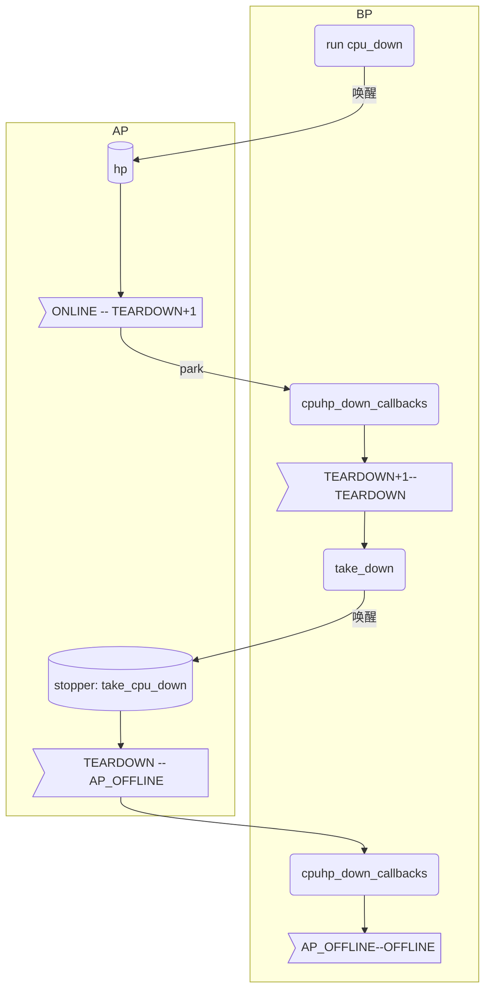

#### question: 

ap: smpboot_thread_func是下线CPU在运行,因为hp线程创建时绑定了运行cpu(通过set_cpus_allowed, cpumask完成)
bp分别是谁在跑

1) boot线与idel线是否为并行运行的
2) boot线最后释放的资源是否会造成影响

#### 下线过程




```c
// 最初一小部分
cpuhp_hp_states[]
cpu_psci_ops

cpu_down(u32 cpu)
|--> do_cpu_down(cpu, CPUHP_OFFLINE);
    
do_cpu_down(cpu, down)  cpu = dev->id
|--> err = cpu_down_maps_locked(cpu, target); target=OFFLINE
|--> _cpu_down(cpu, 0, target);
```

```c
_cpu_down:
struct cpuhp_cpu_state *st = per_cpu_ptr(&cpuhp_state, cpu);
prev_state = cpuhp_set_state(st, CPUHP_OFFLINE);
// st->target = target; st->single = false; st->bringup = st->state < target;
st->target = max((int)CPUHP_OFFLINE, CPUHP_TEARDOWN_CPU);
ret = cpuhp_kick_ap_work(cpu);
|--> ret = cpuhp_kick_ap(st, st->target);
	|--> __cpuhp_kick_ap(st);
		|--> st->should_run = true;
	 ① |--> wake_up_process(st->thread);  // 唤醒
		|--> wait_for_ap_thread(st, st->bringup); //等待st->done_down

		|--> st->target = CPUHP_OFFLINE;
	 ② |--> ret = cpuhp_down_callbacks(cpu, st, CPUHP_OFFLINE);
		
```

```c
① hp线程完成
状态说明：最高 --> CPUHP_TEARDOWN_CPU+1   
static struct smp_hotplug_thread cpuhp_threads = {
	.store			= &cpuhp_state.thread,
	.create			= &cpuhp_create,
	.thread_should_run	= cpuhp_should_run,
	.thread_fn		= cpuhp_thread_fun,
	.thread_comm		= "cpuhp/%u",
	.selfparking		= true,
};
cpuhp_threads_init
|--> BUG_ON(smpboot_register_percpu_thread(&cpuhp_threads));
	|--> ret = __smpboot_create_thread(cpuhp_threads, cpu);
		|--> 	td->cpu = cpu;
				td->ht = ht;  // cpuhp_threads
				tsk = kthread_create_on_cpu(smpboot_thread_fn, td, cpu, ht->thread_comm);
				*per_cpu_ptr(ht->store, cpu) = tsk;
|--> kthread_unpark(this_cpu_read(cpuhp_state.thread));

hp:

smpboot_thread_fn:
while:
	if(!st->should_run)schedule();
	ht->thread_fn(td->cpu);
	|--> state = st->state;
		 st->state--;
		 st->should_run = (st->state > st->target);
		 st->result = cpuhp_invoke_callback  // 回调函数的返回值
         |--> 调用当前状态回调函数
         if (!st->should_run)
			complete_ap_thread(st, bringup);

```

```c
① 补充：CPUHP_TEARDOWN_CPU状态：回调函数takedown_cpu
状态说明： 由takedown_cpu --> CPUHP_AP_OFFLINE
 static struct smp_hotplug_thread cpu_stop_threads = {CPUHP_AP_OFFLINE
	.store			= &cpu_stopper.thread,
	.thread_should_run	= cpu_stop_should_run,
	.thread_fn		= cpu_stopper_thread,
	.thread_comm		= "migration/%u",
	.create			= cpu_stop_create,
	.park			= cpu_stop_park,
	.selfparking		= true,
};   
stooper: cpu_stop_init, 与hp线程相同都是运行smpboot_thread_fn --> cpu_stopper_thread
smpboot_register_percpu_thread(&cpu_stop_threads)
    
    
static int takedown_cpu(unsigned int cpu){
    err = stop_machine_cpuslocked(take_cpu_down, NULL, cpumask_of(cpu));
    // [2]: take_cpu_down
    /*
    	对于每一个cpu
    	work = &per_cpu(cpu_stopper.stop_work, cpu);
		work->fn = fn;
		work->arg = arg;
		work->done = done;
		
		struct cpu_stopper *stopper = &per_cpu(cpu_stopper, cpu);
		DEFINE_WAKE_Q(wakeq);
		__cpu_stop_queue_work(stopper, work, &wakeq);
		wake_up_q(&wakeq);
    */
    wait_for_ap_thread(st, false);
    hotplug_cpu__broadcast_tick_pull(cpu);
    __cpu_die(cpu);  
    // 等待5s
    // 调用op_cpiu_kill, 调用cpu_ops->cpu_kill
    tick_cleanup_dead_cpu(cpu);
	rcutree_migrate_callbacks(cpu);
}


smpboot_thread_fn --> cpu_stopper_thread
static void cpu_stopper_thread(unsigned int cpu){
    if (!list_empty(&stopper->works)) {
		work = list_first_entry(&stopper->works, struct cpu_stop_work, list);
		list_del_init(&work->list);
	}
    if (work) {
		cpu_stop_fn_t fn = work->fn;
		void *arg = work->arg;
		struct cpu_stop_done *done = work->done;

		ret = fn(arg);
		if (done) {
			if (ret)
				done->ret = ret;
			cpu_stop_signal_done(done); // complete(done->completion)
		}
	}
}    
take_cpu_down(){
    enum cpuhp_state target = max((int)st->target, CPUHP_AP_OFFLINE);
    __cpu_disable();
    /*
    	ret = op_cpu_disable(cpu);
    	remove_cpu_topology(cpu);
		numa_remove_cpu(cpu);
		irq_migrate_all_off_this_cpu();
    */
    for (; st->state > target; st->state--) {
		ret = cpuhp_invoke_callback(cpu, st->state, false, NULL, NULL);
	}
}
```


```c
② 由BOOT与stopper线程完成该过程
状态说明：CPUHP_TEARDOWN_CPU --> 最低

static int cpuhp_down_callbacks(unsigned int cpu, struct cpuhp_cpu_state *st,
				enum cpuhp_state target){
    	for (; st->state > target; st->state--) {
			ret = cpuhp_invoke_callback(cpu, st->state, false, NULL, NULL);
	}
}    
```

```c
(*) idle 线程
while(1)do_idle();
tick_nohz_idle_enter: 将tick_cpu_sched->inidle=1

cpuhp_report_idle_dead: smp_call_function_single(cpumask_first(cpu_online_mask), cpuhp_complete_idle_dead, st, 0) 为为什么需要交给其他核运行这个函数？(由于缺失某些资源运行不了？？) 发生了一次核间信息传输，是否还可以调用核间传输

arch_cpu_idle_dead: 
|--> cpu_die()
	|--> cpu_ops[cpu]->cpu_die[cpu]  [cpu_psci_ops]
	|--> cpu_psci_cpu_die
	最后一步到 psci_cpu_off函数

在cpu_die位置设置：此处从do_idle而来并没有进行太多操作
```


```c
设置目标状态:OFFLINE

if state > CPUHP_TEARDOWN_CPU:
target = TEARDOWN
     cpuhp_kick_ap_work(unsigned int cpu)
	 |--> ret = cpuhp_kick_ap(st, st->target);
	 	__cpuhp_kick_ap(struct cpuhp_cpu_state *st);
	 	|--> wake_up_process(st->thread);  # 唤醒cpuhp_thread_fun, 唤醒位置不确定(可能)
		|--> wait_for_ap_thread(st, st->bringup);  bringup=false; 等待st->done_down的值,使当前进程睡眠
		①:
		ret = cpuhp_down_callbacks(cpu, st, target);
		|--> while st->state-- < target
			ret = cpuhp_invoke_callback(cpu, st->state, false, NULL, NULL);
①			

其实hp(cpuhp_threads_init)线程运行的函数为smpboot_thread_fn

这里面调用cpuup_thread_func		

cpuhp_thread_func:
|--> st->result = cpuhp_invoke_callback(cpu, state, bringup, st->node, &st->last);
	|--> cb = bringup ? step->startup.single : step->teardown.single;
	|--> ret = cb(cpu);	
	if (!st->should_run) # 不满足该条件会一直调用cpuhp_thread_func
		complete_ap_thread(st, bringup);
	
sched_cpu_deactive: 状态变为inactive, numa调度域标志
rcu_offline_cpu: 将CPU从rcutree中去除, 通过掩码的方式完成,都是设置操作
workqueue_offline_cpu: 将worker解绑与当前cpu,并于所有wq解除关系
lockup_detector_offline_cpu: watchdog_disable(cpu)
perf_event_exit_cpu

    
[2]:{
hrtimers_cpu_dying(unsigned int dying_cpu)  清除调度定时器的大部分值；将下线cpu的高精定时器类型移动到其他cpu
rcutree_dying_cpu 记录rcu死去时间
sched_cpu_dying(unsigned int cpu) 1.激活所有rq_wait_list任务 2. 停止调度期时钟 3. rq offline 4. 迁移所有进程
}

释放idel->active_mm; 释放 slab_caches


teardown_cpu
(1) 将hotplug暂停
(2) __cpu_disable --> migrate_irq
(3) 状态从TEARDOWN降为AP_OFFLINE  [2]
(4) tick_handover_do_timer();	/* Give up timekeeping duties */ 将当前tick_do_timer_cpu设置为非下线cpu
(5) stop_machine_park(cpu);	/* Park the stopper thread */  通过唤醒stopper线程， 等待stoper线程运行完成
(6) ②
(7) wait_for_ap_thread(st, false);  // wait for the stop thread to go away
(*) idle 线程
(8) __cpu_die: cpu_ops[cpu]->cpu_kill(cpu)  [cpu_psci_ops]  //此处等待了5s

```


```  sh
echo 0 > /sys/devices/system/cpu/cpu3/online
CPU3: cpu didn't die
```


#### 下线函数细节

```c
条件
1. 在线cpu!=1 2. cpu_hotplug_disabled==true    
    
----------------------------------------------------------------------------------

BP唤醒cpuhp线程:    ONLINE -->  CPUHP_TEARDOWN_CPU + 1

[*] sched_cpu_deactivate(cpu);
1. cpu_active_mask清除当前cpu 2. 等待所有RCU读取完成 3.若配置SMT，则减少sched_smt_present的值
4. 由rq->dl.dl_bw结构体值判断当前是否繁忙，不忙则cpuset_update_active_cpus()
5. 从sched_domains_numa_masks中清除cpu   
    
[*] rcutree_offline_cpu(cpu);
1. 该函数用于将指定的CPU从RCU（Read Copy Update）树中离线; 主要是设置rcu_node->mask 2.rcutree_affinity_setting(cpu, cpu); 设置给的rcu_node关联内核线程(rcu_node->boost_thread_task)的CPU亲和性(去除下线cpu)
    
[*] workqueue_offline_cpu(cpu);
1. 解除指定CPU上的工作线程与其关联的CPU绑定； 遍历指定cpu的pool, 将pool的每一个worker的flags设置为UNBOND，pool设置为POOL_DISASSOCIATION 2. 遍历workqueues的wq, 对每一个wq， 将其与原CPU解绑，并创建一个新的pwq，将其挂入这个pwq

[*] lockup_detector_offline_cpu(cpu);
1. watchdog_disable(cpu); 取消当前cpu的watchdog_hrtimer; wd_enabled设置为0；2.还有一个回调函数
    
[*] perf_event_exit_cpu(cpu);
1. 获取perf_cpu_context(pmus->pmu.pmu_cpu_context, cpu), per_envent_context ctx
2. 将ctx->envent_list中的每一个event,从list中删去， 并从perf_group中去除
3. perf_online_mask中清除 

    
[*] smpboot_park_threads(cpu);
1.遍历hotplug_threads中所有变量ht， 将其ht->store设置为KTHREAD_SHOULD_PARK, 唤醒，然后park住

    
----------------------------------------------------------------------------------

主核运行takedown_cpu函数   CPUHP_TEARDOWN_CPU
[*] takedown_cpu(cpu)；
1. 唤醒stooper ：take_cpu_down
 ==============================================================================
 stooper:  CPUHP_TEARDOWN_CPU-1  --> CPUHP_AP_OFFLINE
 (1) __cpu_disable  
 /*    
 	1. 执行cpu_psci_ops->cpu_disable, 没什么作用
 	2. 从topology结构中删除,如遍历cpu_topology[cpu].core_sibling，对于每一个sibling都将当前cpu从其cpu_topology[sibling].core_sibling中清除； cpu_topology[cpu]的core_sibling等的多个cpumaks设置为只有当前cpu
 	3. numa_remove_cpu(cpu):  nid = cpu_to_node(cpu); 将cpu从node_to_cpumask_map[nid]中清除
 	4. cpu_online_mask中清除
 	5. irq_migrate_all_off_this_cpu();  // 迁移irq， 若是affinity设置不允许其他cpu则强则到仍和可用CPU
 		依据allocated_irqs获取每一个irq值；
 		desc = irq_to_desc(irq);  // irq_desc_tree中查找
 		affinity_broken = migrate_one_irq(desc);  主要设置affinity(处理过程较为复杂)
 		|-->  不可移动: percpu中断，中断未开始，中断的mask不包含当前cpu	
 */    
 
********************************************************************************

(3)  stopper运行hoyplug回调函数
     
[*] hrtimers_cpu_dying()   保证迁移高精定时器
1. 取消tick_cpu_sched->sched_timer, 设置tick_cpu_shced的一些值   
2. 将当前cpu的hrtimer_base->clock_base迁移到其他cpu, rb结构体， hrtimer->online=0;     

[*] smpcfd_dying_cpu(cpu); 清除当前cpu队列挂起的smp_call_function回调函数，call_single_queue中获取
    
[*] rcutree_dying_cpu(cpu); 对于每一种rcu_state， trace cpu is offline(only trace)

[*] sched_cpu_dying(cpu);    
1. sched_ttwu_pending: 将rq->wake_list中的进程
    ttwu_do_activate(rq, p, p->sched_remote_wakeup ? WF_MIGRATED : 0, &rf); // 将进程激活(加入队列)，并唤醒
2. tick_work_cpu->twork = TICK_SCHED_REMOTE_OFFLINING
3. rq->online = 0; 各调度类也是    
4. migrate_tasks: 从rq队列中迁移所有进程， 睡眠进程将通过try_to_wake_up完成, 选取一个合适的cpu将任务移动到选取cpu上(现在cpu所在node选取，不行再在p->cpus_allowed); 迁移函数__migrate_task间调度文档的迁移部分
5. nohz_balance_exit_idle(rq); rq->nohz_tick_stopped; nohz.idle_cpus_mask清空等
6. 取消rq->hrtick_timer
    
    
********************************************************************************
 
(4) tick_handover_do_timer() // 设置tick_do_timer_cpu --> Give up timekeeping duties
(5) stop_machine_park(cpu)   //stopper->enabled = false;    
     
 ==============================================================================   

2.hotplug_cpu__broadcast_tick_pull(deadcpu)；  
/* 确保时钟事件可以在其他CPU上继续触发
bc = tick_broadcast_device.evtdev;  时间广播指针
if(bc->bound_on == cpu)
clockevents_program_event(bc, bc->next_event, 1); 
// 设置时钟设备的下一次事件的时间; 设置bc->bound_on = bctimer.base->cpu_base->cpu;
*/    
3. __cpu_die     
/*  此处主CPU看来下线CPU已经真正下线了
	cpu_wait_death: 读取cpu_hotplug_state==CPU_DEAD, 循环比5s； 相等cpu_hotplug_state=CPU_POST_DEAD； 不等设置为CPU_BROKEN
	op_cpu_kill: 调用cpu_psci_ops->cpu_kill：查询cpu的电源状态级别，PSCI_0_2_AFFINITY_LEVEL_OFF则成功
*/    
4. tick_cleanup_dead_cpu(cpu) //清除死去cpu的时钟与时钟事件     
/*
	1. 从广播中移出死亡CPU，清除tick_broadcast_oneshot_mask的标记 2. 清除tick_broadcast_mask等的标记，若tick_broadcast_mask为空，则关闭bc(切换状态值)
	2. 关闭事件设备，
		struct tick_device *td = &per_cpu(tick_cpu_device, cpu);
		struct clock_event_device *dev = td->evtdev;
		然后设置dev设备的一些值， 将dev从当前链表除去，加入clockevents_released
	3. 清除clockevents_released链表中的时钟设备
	4. 遍历clockevent_devices链表，判断每一个时钟设备是否只与当前CPU相关，同时不是广播设备则将其从链表中移除
*/     
 5. rcutree_migrate_callbacks(cpu)； // 保该CPU上挂载的所有RCU回调（callbacks）能够被安全地迁移到其他在线CPU上执行
/*
	遍历rcu_state(RCU变体)：对于每一种RCU类型，将回调重新分配到其他CPU上 1. 会现尝试运行回调函数，2.不行，则将回调函数rcu_state->rcu_data->cblist移动到当前cpu的rcu_data->cblist上
*/     
     
     
----------------------------------------------------------------------------------
    
主核剩余下线函数 
状态变化：CPUHP_AP_OFFLINE -->  CPUHP_OFFLINE

[*] finish_cpu(cpu); 将idle的active_mm引用减1
    
[*] timers_dead_cpu(cpu); 将当前cpu的timer_bases迁移到其他cpu的上

[*] rcutree_dead_cpu(cpu); 对于每一个rcu_state->rcu_data->rcu_node的boost_kthread_task设置其mask， 并执行rcu_nocb_kthread的延迟唤醒

[*] slab_dead_cpu(cpu)；  遍历slab_caches， 获取当前cpu节点对应kmem_cache_node ，释放cachep, 若当前节点没有cpu了，则释放摧毁cachep 

[*] smpcfd_dead_cpu(cpu); IPI关闭
call_function_data *cfd = &per_cpu(cfd_data, cpu);   
free_cpumask_var(cfd->cpumask);
free_cpumask_var(cfd->cpumask_ipi);
free_percpu(cfd->csd);

[*] perf_event_exit_cpu(cpu); 第一阶段已经运行该函数
 
    
    
----------------------------------------------------------------------------------   
    
主核运行完所有下线函数：
    
[*] lockup_detector_cleanup(); 
 /*   
 通过dead_events_mask， dead_event变量： 释放
 struct perf_event *event = per_cpu(dead_event, cpu);
 的dead_event及其子事件在内核的资源
 1. 先脱离envnt->ctx 2.将所有子时间脱离ctx，释放
*/    
    
[*] arch_smt_update();   // 该函数用于根据当前系统的安全漏洞缓解策略，更新处理器的相关控制位。

[*] cpu_up_down_serialize_trainwrecks(tasks_frozen); // hotplug锁序列化问题


```


#### 参考：

> [1] https://blog.csdn.net/weixin_44810385/article/details/133157616    spin_table 与 psci的启动方式