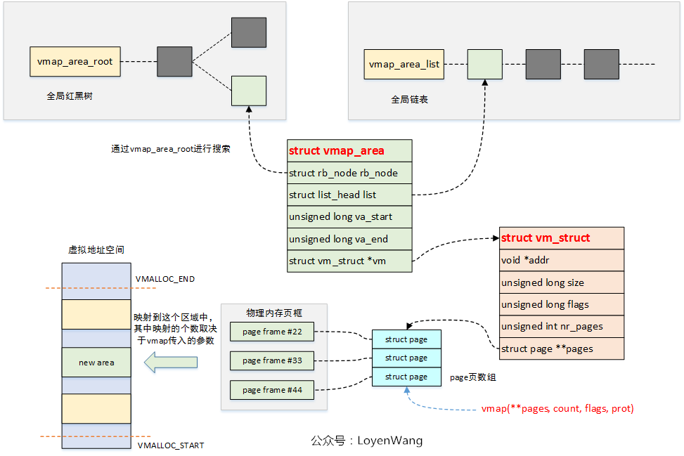

总流程

```c
start_kernel:
	setup_arch
		arm64_memblock_init
			paging_init
				map_kernel
				map_mem 
		bootmem_init
			sparse_init
			
			zone_sizes_init
				free_area_init 
					free_area_init_node
	build_all_zonelists 
	
	mem_init
		mem_init
			memblock_free_all 
	
	buddybuild_all_zonelists 
```

|  |  |
| ------------------------------------------------------------ | ------------------------------------------------------------ |


> vmlinux.lds: 中可以查看各段的地址(如**_text,** **idmap_pg_dir**, **swaooer_pg_dir**)
>
> vmlinux.lds.S: 查看设置

> https://www.cnblogs.com/LoyenWang/p/11406693.html   ==讲太好了==

#### 内核启动 :+1:

+ `__create_page_tables`

> 注意：取址为相对取址，所以一开始取的地址就是变量所在的物理地址

```
(1) 清空init_pg_dir到init_pg_end
(2) 将物理地址的__idmap_text_start到__idmap_text_end区域映射到对应的物理地址（以此可以发生函数跳转，相对跳转）在idmap_pg_dir中。
(3) 将_start与_end的物理地址映射到其对应的虚拟地址地址(KIMAGE_VADDR+_end-_start)
	va = pa+KIMAGE_VADDR
建立两个映射的原因开启MMU时，PC为一个很小的值，采用ttbr0_el1(idmap_pg_dir); ttbr1_el1(init_pg_dir)	
注意：此处为2MB的块映射。

开启mmu：
	bl	__enable_mmu    // 分别设置ttbr0_el1; ttbr1_el1, 设置sctlr_el1寄存器
	ldr	x8, =__primary_switched   // bl	start_kernel
	adrp	x0, __PHYS_OFFSET
	blr	x8
```

+ `start_kernel`

> 首先开启了虚拟映射，但是只有**DTB**的物理地址，而物理地址相关的内容都在**DTB**中，所以得先解析DTB，所以这时候**Fixed map**出现，映射DTB到**fixed map**的区域。而解析的**memory**记录在那儿？**memblock**出现，同时现在只有小范围的物理空间被映射了，那么为需要分配一个页面做一些一些事，memblock便起到了分配空间的作用。

```c
page_address_init; //创建了128个static struct page_address_slot

setup_arch:

		early_fixmap_init；  // 使用FIXADDR_START计算其pgdp,然后各级表项以此填入bm_pud,bm_pmd,bm_pte的物理地址。注意这三个数组都是512大小的数组。 
            // 具体计算：[首先swapper_dir+idx1, 然后这个虚拟地址填写一个bm_pud这个物理地址, 然后计算得到*(swapper+idx1)+idx2这个物理地址，然后用__phys_to_kimg这个宏，将这个物理地址转变为pud这个表项的虚拟地址；然后重复以上过程】
            
// *** 初期只能访问小块区域内存kernel image ***
//  ===fixmap这部分内容主要是用于在MMU enabled ~~ mem_init完成之前阶段内存使用===
/* 	(1)FDT的映射，分配一块固定的FDT虚拟地址用于映射其物理地址使用；
	(2)IOMAP的映射，对于这个阶段外设的使用，这里是有一段地址，分配给到IO使用，与FDT的区别在于，FDT为永久映射，而IOMAP这里是用完擦除；
	(3)paging init的时候使用fixmap的PGD\PMD\PTE等信息，方便建立后续的映射；
*/
            
// FIXMAP: 在Linux内核启动的早期阶段，完整的页表机制尚未建立，动态内存分配器也未初始化。此时，内核需要通过Fixmap（固定映射）机制访问特定的物理内存或硬件寄存器。
// enum fixed_address中记录fixmap的地址区域细分; 包含永久区域用于某个内核模块；临时区域各模块皆可使用。
//	功能用于dtb解析；early console等等
            
        early_ioremap_init；//   将FIXADDR_TOP向下的几个区域的地址写入slot_virt数组中(大小为7), ioremap的空间应此为7*256k，地址保存在slot_virt
            
        setup_machine_fdt: //将__fdt_pointer对应的物理地址与虚拟地址FIX_FDT建立映射 
				memblock_reserve: //memblock_add_range(&memblock.reserved, base, size, MAX_NUMNODES, 0);   base为设备树的物理地址，大小为其大小
				early_init_dt_scan； // early_init_dt_scan_memory:扫描dts的内存节点,调用memblock_add(base, size);添加内存节点； memblock_mark_hotplug标记热插拔
            
   		cpu_uninstall_idmap; // 清空恒等映射，ttbr0设置为reserved_pg_dir
            
        arm64_memblock_init(); 
// ===在启动阶段, 内存分配并不需要很复杂,也不必它多考虑回收再利用，所以使用 memblock 来进行内存分配管理。[直到free_initmem]====

//通过memblock_remove将某些memblock_region区域从memblock.memory中移除，这些区域包含了DDR物理地址所不包含的区域，以及内核线性映射区所不能涵盖的区域；同时将某些物理区间添加到memblock.reserved中，这额区间包含dts中预留区域，命令行中通过参数预留的CMA区域，内核的代码段、initrd、页表、数据段等所在区域，crash kernel保留区域以及elf相关区域。

// 最后保留的区域如下图，添加的是物理地址

当调用memblock_alloc函数进行地址分配时，最后也是调用memblock_add_range来实现的，申请的这部分内存最终会添加到reserved类型中，毕竟已经分配出去了，其他人也不应该使用了。

		paging_init();  // 将前面的swapper_dir的物理地址对应的页，写入了FIX_PGD虚拟地址映射的的pte

			map_kernel; // 早期的映射PGD,PUD,PMD占用的内存是连续的,所以需要重新映射。
			// map_kernel：建立各个段的映射，包含FIXADDR_START, 调用memblock_phys_alloc分配物理页，对应ma添加到vmlist中
			map_mem;	
			// 映射各个memblock块,物理地址映射的虚拟地址有__phys_to_virt(pa)得到， x-ddr起始位置 + PAGE_OFFSET
			// 同时也会将内核段代码映射到PAGE_OFFSET上区域。
			pgd_clear_fixmap; //将已有的FIX_PGD到物理地址的映射取消
			...  // 将获得swapper在PGAE_OFFSET位置的虚拟地址
                // 清空idmap，切换至swapper_dir
			memblock_free(__pa_symbol(init_pg_dir),
		      __pa_symbol(init_pg_end) - __pa_symbol(init_pg_dir)); // 释放init_pg_dir
```

> ref: https://www.cnblogs.com/zhangzhiwei122/p/16062195.html 【memblock】 memblock有两个memblock_type一个memory与一个reserved，memblock_type为一个结构体包含多个memblock_regios,而memblock_regios包含base, size, flag

|  |  |
| ------------------------------------------------------------ | ------------------------------------------------------------ |
|  |                                                              |

```c
//对于非NUMA： 
struct page *mem_map;

// sparse memory 支持热插拔
struct mem_section **mem_section;


bootmem_init:
	arch_numa_init: //NUMA的初始化
	arm64_hugetlb_cma_reserve； //预留cma内存
    dma_pernuma_cma_reserve; // 遍历每一个上线的node，node_states[N_ONLINE], reserve custom contiguous area 
    kvm_hyp_reserve();

	sparse_init; //allocate a mem_map for each and record the physical to section mapping.  section大小为1G
		// 1.遍历 memblock.memory 的每一个区域（跳过无效帧，即起始PFN大于结束FPN），获取其起始帧与结束桢。以PAGES_PER_SECTION为步长，算出这个section=pfn>>PFN_SECTION_SHIFT, 位于数组的第几个位置（section / (4k / sizeof(struct mem_section))）, 并设置这个位置为申请的新申请section的地址。 struct *mem_section[size * 4k/ size * N]; section_to_node_table[section_nr] = nid;  更新__highest_present_section_nr为最大的section_nr

	set_pageblock_order(); // 设置内核最大页的价数

	for_each_present_section_nr(pnum_begin + 1, pnum_end) ... // 遍历每一个node的所有section，获取该node的section数N，对于每一个node
     // 创建了一个mem_section_usage *usage = [N]的数组, 在该节点分配了一段内存由sparsemap_buf指向
     // 遍历每一个section，在sparsemap_buf中分配了map = (siezof page)* PAGES_PER_SECTION大小的地址，相当于分配了PAGES_PER_SECTION个strcuct page;
     
     // __populate_section_memmap
     //   对于每一个section，计算出其第一个pfn在vmemmap数组（VMSTART）中的位置的虚拟地址，然后计算出计算结束地址以此将数组的这一段页桢的虚拟地址都建立映射
        
//【 vmemmap区域是一块起始地址是VMEMMAP_START，范围是2TB的虚拟地址区域，位于kernel space。以section为单位来存放strcut page结构的虚拟地址空间，然后线性映射到物理内存。】
      
     // 设置section的 usage, section_mem_map（设置为map - FPN）
     //  【usage】用于物理页面的压缩，迁移等
```

|  |  |
| ------------------------------------------------------------ | ------------------------------------------------------------ |
|  |                                                              |

> 第三个图的代表的是FPN的各位的作用而不是地址空间的排布


```c
zone_sizes_init:
	// 1. 先计算出ZONE_DMA, ZONE_DMA32, ZONE_NORMAL三个区域的最大页桢的值
	// 2.遍历每一个区域，记录每个ZONE的最大桢与最小桢（内容简单）
	// 遍历所有区域找大最小的区域符合最大桢不大于最小桢的区域，赋值给movable_zone
	// find_zone_movable_pfns_for_nodes： //遍历所有内存区域（只针对可热插拔的区域），找到每个node的最小可移动桢
	//  遍历所有内存区域，获取每个内存区域的起始桢与桢数， 得到这个内存区域的section数量，计算每个section内属于内存区域的，桢区域（应该只有头尾可能出现，section内存在桢不属于内存区域），然后设在这个section中哪些桢是可以使用的
	// nr_node_ids = 最大节点数
	// 遍历每一个节点:
			1. 遍历每一个ZONE，获取每一个ZONE的起始地址与结束地址，由可能的最大桢与最小桢得到，并且调整可移动内存的ZONE区域， 获取该区域的跨度与缺失桢（内存区域包含ZONE的区域，主要还是排除首位与包含不连续内存区域的ZONE的）
            2. 由1计算出每个ZONE的页面数量，起始桢等，并记录到pglist_data中，并统计节点的页面数量
            3. 使pgdat->node_mem_map指向一片地址，该地址为当前节点的空间区域的所有页结构体的地址
            4. 初始化pgdat的内部结构如锁，统计变量；遍历每一个ZONE， 累计内核的可用页面数量，与所有页面数
            5. 初始化zone的cpu的页集与水位线等，设置pageblock_order大小（内存迁移与隔离的单位）
            6. 为每个ZONE分配usemap记录每个pageblock的迁移类型
            7. 标记当当前ZONE为空闲区域【 初始化zone->free_area[].free_list[] 链表为空 】
                				    【zone->free_area[order].nr_free = 0】
       mem_map = NODE_DATA(0)->node_mem_map;
```

|  |
| ------------------------------------------------------------ |

**buddy**

```c
请求标志gpp_mask: __DFP_DMA
分配标志alloc_flags: ALLOC_CMA

start_kernel:
	build_all_zonelists(NULL);
		1. __build_all_zonelists //node_load清空（各NUMA节点的负载情况）
         	1.1 遍历每一个node，然后调用build_zonelists
            	// 以此获取其他节点与当前节点【最近】的节点， 由距离最进到最远的顺序，并记录这个排序，并设置对应的node_load节点负载值(n, n-1, ... 1)
            	// 以上面的节点顺序，将其他节点的每一个zone按照顺序添加到本节点的pgdat->node_zonelists[ZONELIST_FALLBACK]._zonerefs;
            	// 本节点的所有zone都添加到pgdat->node_zonelists[ZONELIST_NOFALLBACK]._zonerefs(按照由高到低)
            	// 遍历每个cpu，设置每个cpu的最佳node？（设置到percpu变量数组中）
        
            
        2. 遍历每一个cpu，设置其per_cpu_pages（初始化一个链表数组， 为每个 CPU 提供一个本地的、快速访问的空闲页列表）， per_cpu_zonestat
        3. 设置current->mems_allowed为最大的节点值
            	
```

> 页面分配的过程中，有一个结构叫`struct alloc_context`，这个结构用于存储各个函数之间传递的参数。与全局变量效果相近。

|  |
| ------------------------------------------------------------ |

```c
mm_init
	mem_init:
		memblock_free_all：
            reset_all_zones_managed_pages // 将每个node的每个zone管理区域清空
            free_low_memory_core_early
            	// 1. 遍历reserve区域的的地址区间，将去见内的所有页都设置为PG_reserved
            	// 2. 遍历所有区域，若区域的标记为MEMBLOCK_NOMAP，则将其所有页标记为PG_reserved
            
            	// 3.遍历属于memory，不属于reserved的区域
            			__free_pages_memory // 使用该区域的起始于结束地址， 循环分割这个区域的物理地址
            			// 通过判断该桢最低位的1是第几位判断，其可以归属于哪个order，但是最大不超过10
            			// 得到order值后，将这一个连续内存所有页都清空保留标记，并且通过第一个页的nid值得到其pgdat,然后通过这个页的flag得到其所属于的ZONE，这样便将这一个连续页的大小累加到这个ZONE的managed_pages
            			// 最后通过将该内存区域判断是否可以合并，不能合并则加入buddy
            			// 首先第一个页的private设置为order，设置buddy标记，然后
            			// list_add(&page->lru, &area->free_list[migratetype]);
```


|  |
| ------------------------------------------------------------ |

|                                                              |                                                              |
| ------------------------------------------------------------ | ------------------------------------------------------------ |
|  |  |

+ fast path

> 就是找到一个节点，遍历这个节点的zone区域看是否有满足要求的区域。

```c
alloc_pages(gfp, order):
	(1) 如果gfp指定非本节点，获取task->mempolicy 或者 当前节点的mempolicy
    (2) mempolicy可能是MPOL_INTERLEAVE(均匀的在多个节点分配,循环选择)和 MPOL_PREFERRED_MANY(从指定的多个节点分配); 
	__alloc_pages:
		1. prepare_alloc_pages 初始化struct ac_context用于函数间共享参数，主要[设置了zonelist, highest_zoneidx, preferred_zoneref(由node，gfp_mask)] // 重要
        2. 设置alloc_flags
        3. get_page_from_freelist // fastpath， 分配被限制了最低价数
            1. 进行多个判断处理cpu_set_allow, 跳过脏页限制的页， 若不允许回退于非本地节点分配，则允许碎片分配
            2. 计判断水位，对于order等于0,判断当前剩余页数是否大于最低水位；order大于0判断内容多一些
            	1. 对于内存不足的情况，若有延迟初始化，并且该页有延迟初试的页，则try_this_node
            	2. 若当前zone于preferred_zoneref距离满足,则在内存紧张的情况下回收内存，若是回收足够或者本来便不需要回收内存，则直接 try_to_zone
            
            try_to_zone:
				rmqueue:
					1. 满足pcp的order要求, 依据order与类型找到对应的list，从list中分配页
    					1. 若是list为空则在伙伴系统中获取页面
   					 		__rmqueue（1. 从最小满足的页块分配__rmqueue_smallest；2.CMA中按照__rmqueue_smallest分配；3.其他类型空闲列表分配，并拆分至请求的类型）
   						2. 不为空则取出第一个页
                        
    				2. __rmqueue_smallest: 从当前zone的对应类型的free_area中按照低到高的顺序尝试分配
                    3. 失败则	__rmqueue:
				prep_new_page： 设置新分配的页面的结构
```

|  |
| ------------------------------------------------------------ |
|  |


+ slow_path

```c
__alloc_pages_slowpath:
	first_zones_zonelist: // 查找第一个符合条件的内存区域(不超过highestest_zoneidx, 属于node_mask)可能就是本zonelist
	
	1. 下图中的wake_all_kswapds （根据node_mask决定唤醒哪些节点的kswapd）
        ->wakeup_kswapd: 1.若是kswapd失败过多(pgdat->kswapd_failures)或者内存已经平衡且需要高阶分配，则唤醒kcompactd; 2.否则唤醒kswapd(pgdat->kswapd_wait)
            
    2. __alloc_pages_direct_compact： 【直接内存压缩】
            // 首先标记内存stall；尝试压缩内存（try_to_compact_pages）；尝试get_page_from_freelist
            try_to_compact_pages： // 遍历所有可能节点的zone
            	// 若是压缩优先级较高且压缩被延迟，则跳过该区域
            	// 压缩compact_zone_order -> compact_zone
            	// 压缩成功则重置压缩延迟；不成功则判断是否为异步压缩且需要调度值或者遇到信号，则跳出遍历
            		compact_zone: 
					// 1. 从判断得到的起始桢与结束桢；	
					// 2. 调用isolate_migratepages隔离可迁移页面
  					// 3. 通过migrate_pages执行迁移
						
	3. __alloc_pages_direct_reclaim 【直接回收内存】
        	1. __perform_reclaim // 直接回收内存
        		// 进入一个循环，调用shrink_zones回收内存，当回收足够或者压缩就绪则跳出循环
        		// 处理cgroup的回收
        			shrink_zones
        				// 1.某些情况下线尝试强制回收highmem；2. 判断cpuset是否满足，压缩是否准备好避免进行不必要的回收；3.
        
        	2. get_page_from_freelist
        
        	3. 尝试会所所有per-cpu pages, 然后再次尝试get_page_from_freelist，尝试从cgroups memory中回收页面
        		shrink_node：
        			// 1.首先获取目标内存控制组在当前节点的LRU向量；2.分别判断当前的匿名页与文件页中active与deactive的比例，决定是否将活动链表页面移动到非活动链表页面；3.若非活跃文件页足够且未被停用，优先回收文件页（避免过早触碰匿名页）4. 若是文件页+空闲页 < 高水位线，则调整回收策略 4. shrink_node_memcgs 回收； 5. 若是当前执行者为kswapd，判断是否大量回写，或者是否需要停止等待防止RCU循环过快； 不是kswapd，可能会等待IO完成，防止底层存储拥堵
        			shrink_node_memcgs： 
        				//遍历所有的memcg及其子组，然后回收
        					1. shrink_lruvec 回收匿名页与文件页:1.计算匿名页与文件页的扫描比例；2.合并块设备的IO
                                3.根据LRU的类型决定shrink_active_list / shrink_inactive_list
                                
                               /* shrink_inactive_list
                                    功能：回收非活跃LRU中的页面。
                                    流程：
                                        + 隔离页面：调用isolate_lru_pages从LRU链表中隔离页面。
                                        + 页面回收：通过shrink_page_list尝试回收页面（如写回文件、交换到磁盘）。
                                        + 放回LRU：回收失败的页面重新放回LRU链表。
                                   shrink_active_list
                                    功能：将活跃LRU中的页面移至非活跃列表。
                                    触发条件：
                                    + 页面被引用次数较少。
                                    + 文件页执行一次后激活（VM_EXEC）。 
								*/        
        					2. shrink_slab 回收slab
        
     4. should_reclaim_retry：未达到重试此数为处于OOM,回收未进展次数是否超过阈值
     5. should_compact_retry：压缩等级未达到最低, 重试次数未达上限
     6. alloc_pages_may_oom： 系统未处于内存冻结，当前进程未被标记未OMM受害者
                               //out_of_memory 杀死进程释放内存

回收策略：
(1) 比例回收（Proportional Reclaim）
场景：默认优先级（DEF_PRIORITY）下的全局回收。
逻辑：按匿名页和文件页的成本动态分配扫描压力，确保两者按比例回收。
(2) 优先回收非活跃页
原则：优先回收非活跃页（LRU_INACTIVE_ANON/LRU_INACTIVE_FILE），因其更可能被释放。
例外：当非活跃页过少时，强制回收活跃页以平衡比例。
(3) 二次回收（OOM前的最后尝试）
触发条件：首次回收未满足需求，且sc->memcg_low_skipped为真。
逻辑：强制回收受memory.low保护的memcg页面，避免OOM。        	
```

```c
free_page:
	1. 单页面放回pcp链表
	2. 将页面添加如伙伴系统的空闲链表，并且释放时会检测是否与相邻空闲内存合并
```


> 注没有提及都看图

|  |
| ------------------------------------------------------------ |


##### 伙伴系统

`struct page`结构中，与`Buddy System`相关的字段有：

- `_mapcount`： 用于标记`page`是否处在`Buddy System`中，设置成`-1`或`PAGE_BUDDY_MAPCOUNT_VALUE(-128)`；
- `private`： 一个`2^k`次幂的空闲块的第一个页描述符中，`private`字段存放了块的`order`值，也就是`k`值；
- `index`： 存放`MIGRATE`类型；
- `_refcount`： 用户使用计数值，没有用户使用为0，有使用的话则增加；

|  |
| ------------------------------------------------------------ |

+ 页面分配

|  |  |
| ------------------------------------------------------------ | ------------------------------------------------------------ |

```c
后备迁移类型数组:
static int fallbacks[MIGRATE_TYPES][4];
	从后备迁移类型中找到一个迁移页面块，然后移动到目标内存页面
```

+ 页面释放

当`order = 0`时，会使用`Per-CPU Page Frame`来释放，其中：

- `MIGRATE_UNMOVABLE, MIGRATE_RECLAIMABLE, MIGRATE_MOVABLE`三个按原来的类型释放；
- `MIGRATE_CMA, MIGRATE_HIGHATOMIC`类型释放到`MIGRATE_UNMOVABLE`类型中；
- `MIGRATE_ISOLATE`类型释放到Buddy系统中；
- 若PCP溢出，则free_pcppages_bulk释放则`Buddy`

```c
// 释放时：会将出现合并
```

|  |
| ------------------------------------------------------------ |
|  |

##### 

##### 水位的问题

- `WMARK_MIN`
  内存不足的最低点，如果计算出的可用页面低于该值，则无法进行页面计数；
- `WMARK_LOW`
  默认情况下，该值为`WMARK_MIN`的125%，此时`kswapd`将被唤醒，可以通过修改`watermark_scale_factor`来改变比例值；
- `WMARK_HIGH`
  默认情况下，该值为`WMARK_MAX`的150%，此时`kswapd`将睡眠，可以通过修改`watermark_scale_factor`来改变比例值；

|  |  |
| ------------------------------------------------------------ | ------------------------------------------------------------ |

|  |
| ------------------------------------------------------------ |


##### 内存压缩

内存碎片分为内碎片和外碎片：

- 内碎片：内存页里边的碎片；
- 外碎片：内存页之间的碎片，可能会造成连续物理页面分配失败。

`migrate_type`用于描述迁移类型：

- `MIGRATE_UNMOVABLE`：不可移动，对应于内核分配的页面；
- `MIGRATE_MOVABLE`：可移动，对应于从用户空间分配的内存或文件；
- `MIGRATE_RECLAIMABLE`：不可移动，可以进行回收处理；

|  |
| ------------------------------------------------------------ |
|  |
| `` |

```
compaction_suitable： 主要时空闲页面大于水线但没有空闲的页块；空闲页面-申请页面大于水线

扫描过程：
	以pageblock_nr_pages为单位,扫描可运动的页，添加到compact_control->migratepages (向上)
							  扫描空闲的页，添加到compact_control->freepages (向下)
	
	migrate_pages:
	+ 先在freepages取出一个空闲页
	+ 1）调用try_to_unmap删除进程页表中旧的映射关系，在需要访问的时候再重新映射到新的物理地址上；2）调用move_to_new_page函数将旧页移动到新的物理页上(一个汇编代码完成页面迁移)
	
	最后compact_finished：检测页面是否迁移完成(找到空闲页了，或者上下扫描相遇)
```

|  |
| ------------------------------------------------------------ |


##### 内存回收

​	每个`Node`节点会维护一个`lrvvec`结构，该结构用于存放5种不同类型的`LRU链表`，在内存进行回收时，在`LRU链表`中检索最少使用的页面进行处理。

​	为了提高性能，每个CPU有5个`struct pagevecs`结构，存储一定数量的页面，最终一次性把这些页面加入到`LRU链表`中。

> 物理内存进行回收的两种方式：
>
> - 直接回收，比如某些只读代码段等；
> - 页面内容保存后再回收；
>
> 页面内容保存又分为两种情况：
>
> 1. `wap`支持的页，写入到`swap分区`后回收，包括进程堆栈段数据段等使用的匿名页，共享内存页等，`swap`区可以是一个磁盘分区，也可以是存储设备上的一个文件；
> 2. 存储设备支持的页，写入到`存储设备`后回收，主要是针对文件操作，如果不是脏页就直接释放，否则需要先写回；
>
> ==UNEVITABLE==：**锁定在内存**

|  |
| ------------------------------------------------------------ |

上述的每个CPU5种缓存`struct pagevec`，基本描述了`LRU`链表的几种操作：

- `lru_add_pvec`：缓存不属于`LRU链表`的页，新加入的页；
- `lru_rotate_pvecs`：缓存已经在`INACTIVE LRU链表`中的非活动页，将这些页添加到`INACTIVE LRU链表`的尾部；
- `lru_deactivate_pvecs`：缓存已经在`ACTIVE LRU链表`中的页，清除掉`PG_activate, PG_referenced`标志后，将这些页加入到`INACTIVE LRU链表`中；
- `lru_lazyfree_pvecs`：缓存匿名页，清除掉`PG_activate, PG_referenced, PG_swapbacked`标志后，将这些页加入到`LRU_INACTIVE_FILE`链表中；
- `activate_page_pvecs`：将LRU中的页加入到`ACTIVE LRU链表`中；

|  |
| ------------------------------------------------------------ |

> https://www.cnblogs.com/LoyenWang/p/11827153.html 太复杂了
>
> 上图：shrink_active_list
>
> 下图：shrink_inactive_list

|  |
| ------------------------------------------------------------ |
|  |


##### slab

```
slab: 对于NUMA有多个slab节点, slab节点的链表挂有多个slab分配块
	1. 创建slab描述符 kmem_cache; 其array_cache结构体即可以描述共享缓冲池也可以描述本地缓冲池(对象地址)
	2. 初始化kmem_cache的各成员变量值如一个slab分配器具有多少个页面，包含多少个对象。添加入slab_caches全局变量

slab分配器: [着色区, n*obj, freelist]  freelist每个成员变量占一个字节,代表一个obj;
依据freelist的大小与slab对象的大小比较结果, 剩余空间大小决定freelist的位置
kmem_cache_node slab节点, 三个链表

slab对象分配: kmem_cache_alloc
	1. 先看本地对象池  (但是第一次分配时是没有的， 3个链表也是空的。所以会分配一个slab)
	2. 看共享池，贡献池有则从贡献池拿
	3. 查看slab节点,从slab节点拿取多个对象到本地池
	4. slab也没有，则分配slab分配器，将slab分配器其放入合适的slab节点的合适队列
slab对象释放: kmem_cache_free
	1. 当本地贡献池的空闲对象大于阈值时会触发回收动作
		1.1 看贡献池空闲对象是否达到阈值, 没有则复制到共享池, 达到则释放共享对象
		1.2 slab没有活跃对象则将其添加入free链表，有则添加入部分free链表  （活跃对象迁移到了池中）
		1.3 若是slab节点的空闲对象超过阈值则销毁slab分配器
	2. 将对象放回本地池
注意：
(1) slab调用伙伴系统分配页面的， 页面被标记PG_slab
(2) 回收问题：一、是在主动释放对象时检测。二、是定时器，扫描所有slab描述符号
```

> kmem_cache: cpu_nr个kmem_cache_cpu， node_nr个kmem_cache_node
>
> kmem_cache_cpu：slab的页面；	
>
> kmem_cache_node：slab页面链表

|  |
| ------------------------------------------------------------ |
|  |
|  |


##### VMALLOC

> 虚拟地址连续而物理地址不连续。从`VMALLOC_START, VMALLOC_END`分配
>
> `struct vmap_area`用于描述一段虚拟地址的区域

|  |
| ------------------------------------------------------------ |
|  |


```c
内存分配：
    vmap
    	1. 从slab中分配vm_struct；
    	2. 分配vmap_area，并在虚拟空间范围中找到空的映射空间，并添加到链表与红黑树中
    	3. 将vm_struct与vmap_area绑定
    	4. 将vm_struct虚拟地址范围的页表建立映射
	vunmap:
		1. 从vmap_area_root中搜索vmap_area
        2. vmap_area从红黑树与链表中移除
        3. 取消页表映射
    
   vmalloc与map中大体相似，只是vmap中page是由函数中传出来的；而vmalloc是由alloc_page向Buddy_System中申请。
```


##### mmap相关

> 用户进程的地址空间

|  |
| ------------------------------------------------------------ |

`mmap`用于内存映射，将一段区域映射到自己的进程地址空间中，分为两种：

- 文件映射： 将文件区域映射到进程空间，文件存放在存储设备上；
- 匿名映射：没有文件对应的区域映射，内容存放在物理内存上；

同时，针对其他进程是否可见，又分为两种：

- 私有映射：将数据源拷贝副本，不影响其他进程；
- 共享映射：共享的进程都能看到；

|  |
| ------------------------------------------------------------ |
|  |

```c
对于ext4: thp_get_unmapped_area
对于共享映射：
	1. fd=-1; flags=MAP_ANONYMOUS|MAP_SHARED
	2. 直接打开 'dev/zero'
        
匿名映射：
        arch_get_unmapped_area
```


##### 缺页

|  |
| ------------------------------------------------------------ |
|  |
|  |

> 具体的触发处理：[【原创】（十四）Linux内存管理之page fault处理 - LoyenWang - 博客园](https://www.cnblogs.com/LoyenWang/p/12116570.html)
>
> https://cloud.tencent.com/developer/article/2373334 mmap图详细

````c
pte不存在：
    do_anonymous_page:(若为匿名页)
        触发：1. 只分配地址空间，初次访问触发；2.用户栈扩大处理
        处理: 1. 对于只读操作，映射到0页；2.对于其他的在高端内存分配一个物理页，并生成对应页表项填入，建立物理页与虚拟页的反向映射，并将物理页添加至LRU链表

    do_fault:(若不为匿名页)
        (1)读文件错误：
                do_read_fault: 1.故障附近多映射一些页do_fault_around；2.文件中读取页；3.设置页表
                    do_fault_around:先计算出附近的起始位置与结束位置；然后调用文件自己的 (.map_pages)将附近文件页预取进page cache；然后调用 __do_fault映射本页:先从page cache中读取，若无则从磁盘中读取，并预取若干页到page cache

    __do_fault: [1]文件页在内存page cache，则调用do_async_mmap_readahead异步预读；若不在则do_sync_mmap_readahead同步读取，然后获取页；[2]同步读，先分配一个物理页，将分配页添加至page cache，然后通过address_space_operation->readpage激活块设备读取。[3]finish_fault:将文件页映射到pte中，将创建的物理映射到页表中          

        (2)写私有文件：
               do_cow_falut: 1.分配一个页面cow_page；2._do_fault从文件中读取页；3.将fault_page页面拷到新页面，设置页表项
               注意：由于cow_page脱离了page cache，所以修改不会写回磁盘中。    

        (3)写共享页：
               do_shared_fault: 1._do_fault文件中读取页；2.设置脏页标记 

               注意：与do_cow_fault的区别是对文件的修改反映在page cache上，后续写回磁盘


pte存在，但是页不在内存中：
        do_swap_page:
			swap交换区分为swap文件与swap分区；而内核的多个交换区被记录在swap_info[]中，swap_entry_t实现确认swap_info的idx，然后确认在该交换区的那个slot中即offset（一个交换区有多个slot，slot大小为4k）
			swap_entry_t: 0位是否在内存; 7:2 swp_indx; 57:8: swp_offset;
			swap_info_struct有对应磁盘设备的块设备指针。
        核心函数：swap_readpage:[1]找到交换文件的file,读取匿名页到page中，注意不会将page放入page cache中，因为这不是一个正常的文件；[2]对应wap分区，则直接从磁盘块中读取。[3]然后建立映射，加入lru
            
            swap cache：可能出现多个进程指向的页面被换出，然后一个进程进行页面换回后其他进程的pte不能感知这个行为的情况。
            【*】所以上面在换入的时候会检测是swap cache中是否已经有了。
       
pte在内存中，但是标记未_PAGE_PROTNONE(无读写，可执行权限，那么便会将该page迁移到进程运行的numa节点上)
    	do_numa_page:

pte存在，vma可写，但是pte不可写： 发生cow(父子进程间；mmap映射后，do_read_fault加载到page cache但是pte为只读)
		do_wp_page:->wp_page_copy:[1]如果是zero page，则分配物理内存并清空；否则分配一个物理页，并拷贝数据到这个页；[2]页加入LRU中；[*]如为匿名页且引用技术为1，pte修改为可写即可；若vma为共享可写，则也复用当前的页面即可				
	
````

> 私有文件映射的特点未读共享，所以任意进程发生对私有文件映射的写操作时，都会发生COW。
>
> 当多个进程对同一文件就行私有映射后，他们的file->inode会指向同一个**inode**，inode的`struct address_space * i_mapping`指向==page cache==


##### RMAP

> 物理地址反向映射到虚拟地址。
>
> 当某个物理地址需要回收（如`kswapd`）或者迁移时，反向映射找到VMA，然后从VMA使用的用户页表中取消映射。

```c
对于匿名页来说：
	page->mapping = anon_vma + 0x01;  // mapping的最低位为1，则mapping指向anon_vma;当最低位为0时，mapping指向struct address_space; 而index表示内存页在磁盘文件的offset
	page->index = linear_page_index(vma, address); 
	// value = (address-vma->start)>>PAGE_SHIFT + vma->vm_pgoff;
```

```c
struct vm_area_struct {
	struct list_head anon_vma_chain; 
	struct anon_vma *anon_vma;	
}
struct anon_vma {
	struct anon_vma *root;	
	struct anon_vma *parent;	
	struct rb_root_cached rb_root;
};
struct anon_vma_chain {
	struct vm_area_struct *vma;
	struct anon_vma *anon_vma;
	struct list_head same_vma;  
	struct rb_node rb;			
};
```

+ `AVC`通过`same_vma`挂入`VMA`的`anon_vma_chain`
+ `AVC`通过`rb`挂入`AV`的`rb_root`

为什么AV不直接与AVM直接连接？

> 因为每个匿名物理页只能指向一个anon_vma，但是一个匿名物理页可能被多个进程连接。所以这种1对1的连接时不行的，需要一个1对多的连接方式。

那么为什么不直接把VMA作为一个节点挂入anon_vma的红黑树？

> 当进程死亡时，映射物理页便不在被映射，但是此时需要将anon_vma中的反向映射VMA的记录删去，所以需要VMA找到anon_vma的途径，但是VMA中的可能映射有多个物理匿名页，这些物理匿名页指向同一个anon_vma；
>
> 需要通过vma->anon_vma_chain才可以得到进程包含的所有anon_vma, 并从anon_vma的红黑树中删去，表示该物理页不在映射VMA

|                                |
| ------------------------------------------------------------ |
|  |

```c
do_anonymous_page:
	anon_vma_prepare(vma); // 若是当前的vma->anon_vma存在，则直接结束。
	// 1.分配一个avc；2.在相邻的区域的VMA中查找一个anon_vma(或者直接分配一个VMA)；
	// 3.vma->anon_vma=anon_vma; list_add(avc->same_vma, vma->anon_vma_chain);
	//  anon_vma_interval_tree_insert(avc, &anon_vma->rb_root);
	// avc->vma = vma; avc->anon_vma = anon_vma;

	page =  alloc_zeroed_user_highpage_movable(vma, vmf->address); 	
	page_add_new_anon_rmap(page, vma, vmf->address);

```

#### 问题

+ zone的建立
+ numa相关的内容
