#### 内核启动 :happy:

+ 机器上电，将PC设置为0（arm上此设置），此时MMU未开启。对于嵌入式设备来说，物理地址0为NOR闪存。


 +  设备上电或复位后，处理器首先从内部不可修改的 **BootROM** 开始执行。会检测启动介质（比如SD卡、eMMC、SPI Flash等）的状态。将启动介质中的Miniloader（SPL:uboot的前部分）加载到内存中（可能是内部**SRAM**）；

> 0地址为映射到了芯片内部的BootROM区域

+ 执行Miniloader：完成初始化DDR控制器；加载并启动第二阶段引导程序（U-Boot）

 +  执行uboot：负责后续的硬件初始化、设备树(Device Tree)的加载与传递、并最终加载Linux内核镜像与DTB。

uboot的两种启动方式：见[启动](../psci&spin-table.md)

##### 内核开始

```c
入口 __head:  xo=FDT blob     arc/arm64/kernel/head.S
	直接跳转到stext
stext：
	1. 将引导参数保存至boot_args变量中; x1到x4保存到 boot_args变量中;
	2. el2_setup: 
		（1）依据启动的等级，同时是否支持虚拟化扩展决定是否在el2执行内核。否则el1执行内核。（2）el2包含物理定时器，gicv3的设置，处理器ID，调试，性能监控相关寄存器，是否支持大页映射。
                       
	3. 初始化页表
```

> VHE: KVM(一个内核模块)将内核变为虚拟机监控程序。
>
> ```c
> // QEMU创建一个KVM虚拟机，与虚拟机的交互方式如下：
> fd=open("/dev/kvm", O_RDWR);
> wmfd = ioctl(fd, KVM_CREATE_NM, 0);
> vcpu_fd = ioctl(vmfd, KVM_CREATE_VCPU, 0); // 每个虚拟机处理器是一个线程(一个kvm_vcpu结构体);
> 
> ioctl(vcpu_id, KVM_RUN, 0); // QEMU进程经入内核，KVM模块获取到对应 vCPU 的上下文，KVM 模块准备虚拟 CPU 状态。 KVM执行KVM_RUN由el1->el2（首先保存保存所有寄存器，然后将寄存器的值设置为客户操作系统的寄存器的值，由el2到el1执行客户操作系统）
> 
> // 若是支持VHE：陷入内核后便是el2, 只需要el2->el1
> 
> 注：
>     1. HCR_EL2中，hypervisor明确设置了应当拦截guest操作中的哪些操作或者异常。当硬件检测到时会将异常自动转移至el2,而不是guset的el1或者el0(硬件标记了当前为guest环境)；
> 	2. 无论当前的vcpu进程运行与el0或者el1,当中断或者异常事件发生时，(1)硬件处理:保存guset的信息如pc,异常信息；进入el2；(2):跳转至el2的异常向量，将通用寄存器等保存至vCPU内存结构；(3)运行vmexit处理；(4)返回至vCPU的函数，退出guest状态，进一步处理中断或者异常；(5)完成中断或者异常处理后，恢复guest上下文(eret完成)(vmentry);
> 	*. 异常处理内容根据需要可可能(1)通过vmentry转到guest中执行；(2)通过异常返回机制返回至宿主内核执行的el1；
>         但是所有的处理化处理都是在el2的hypervisor处理完成的。
>         
> ```


```c
4. __primary_switch:
	(1) 将init_task写入sp_el0, 并设置init的栈;sp=intit_task->stack + THREAD_SIZE - PT_REGS_SIZE + S_STACKFRAME;
	(2) 将init_task的__per_cpu_offset[cpu]写入tpidr_el1;
	(3) bl	start_kernel;
```

```c
cgroup_init_early:
	init_cgroup_root(): // 设置了cgroup_root的cgroup变量的各个变量，主要是初始化各个链表。包含各个资源子系统的链表。 
						// init_task.cgroups = &init_css_set
						// 初始化各个资源子系统
setup_arch:
	setup_initial_init_mm(_stext, _etext, _edata, _end); //将这几个值设置到init_task上
```

````c
0:idle, 1:init
init会执行kernel_init(), 调用execve()，装入init进程。如/sbin/init, /bin/init或者/bin/sh。
init变为普通进程后依据`/etc/inittab`文件内容启动一些任务，如初始化系统设置，启动一个登录对话。
    
````


| 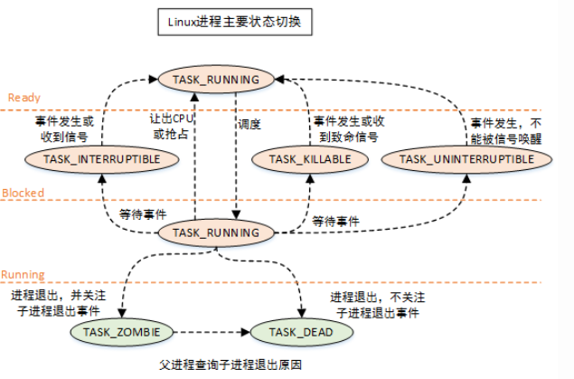 |
| ------------------------------------------------------------ |
| 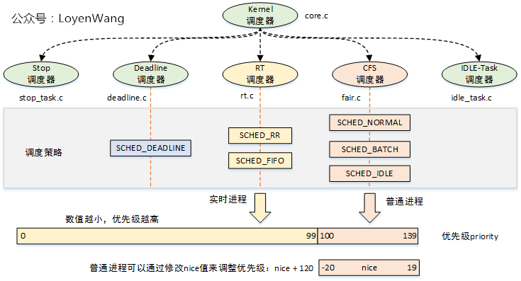 |

Linux内核使用`struct sched_class`来对调度器进行抽象：

1. `Stop调度器， stop_sched_class`：优先级最高的调度类，可以抢占其他所有进程，不能被其他进程抢占；
2. `Deadline调度器， dl_sched_class`：使用红黑树，把进程按照绝对截止期限进行排序，选择最小进程进行调度运行；
3. `RT调度器， rt_sched_class`：实时调度器，为每个优先级维护一个队列；
4. `CFS调度器， cfs_sched_class`：完全公平调度器，采用完全公平调度算法，引入虚拟运行时间概念；
5. `IDLE-Task调度器， idle_sched_class`：空闲调度器，每个CPU都会有一个idle线程，当没有其他进程可以调度时，调度运行idle线程；

- `SCHED_RR`：实时进程调度策略，时间片轮转，进程用完时间片后加入优先级对应运行队列的尾部，把CPU让给同优先级的其他进程；
- `SCHED_FIFO`：实时进程调度策略，先进先出调度没有时间片，没有更高优先级的情况下，只能等待主动让出CPU；

| 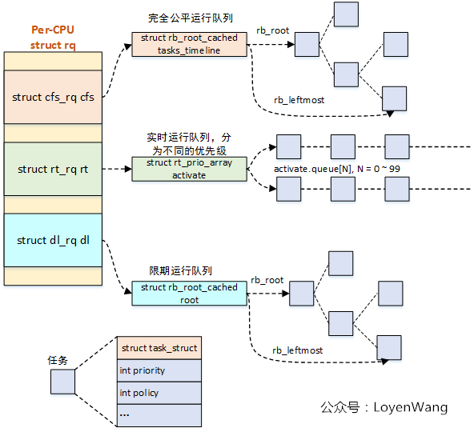 |
| ------------------------------------------------------------ |

##### 调度时机

| 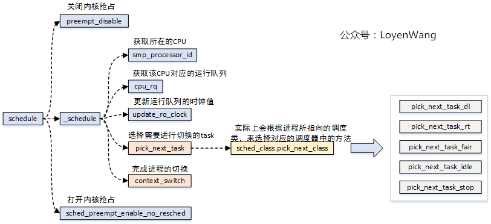 |
| ------------------------------------------------------------ |
| 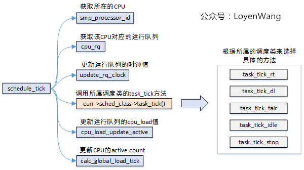 |

> 时钟中断中会检测是否执行超时，若是则设置重新调度`_TIF_NEED_RESCHED`。
>
> 在中断返回时，若为中断进程在用户模式运行，则检测是否重新调度，然后调度。

| 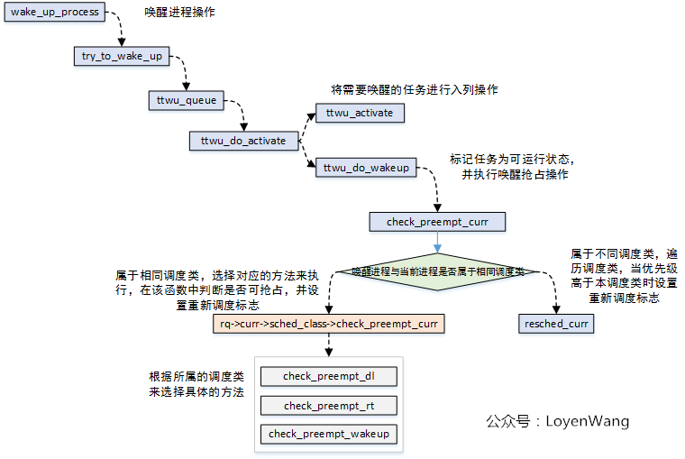 |
| ------------------------------------------------------------ |

##### 进程切换

+ 用户抢占

内核中设置`TIF_NEED_RESCGED`标志的位置

| 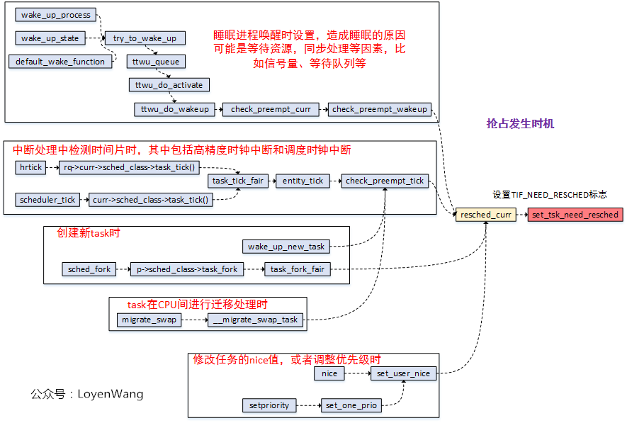 |
| ------------------------------------------------------------ |

抢占位置

| 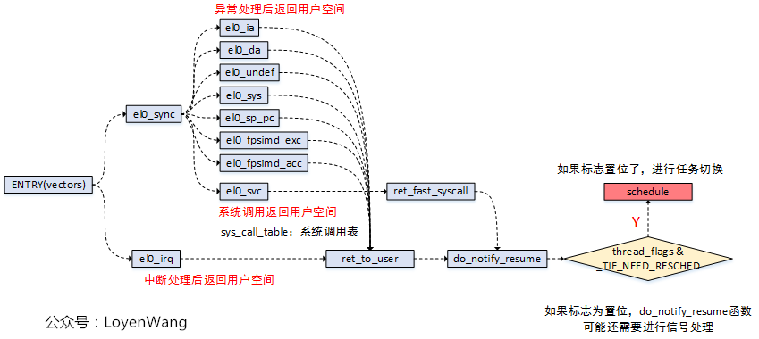 |
| ------------------------------------------------------------ |

+ 内核抢占

三种抢占模型

| 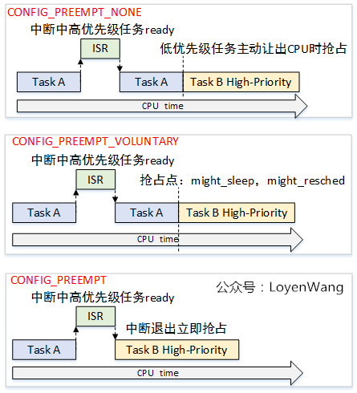 |
| ------------------------------------------------------------ |
| 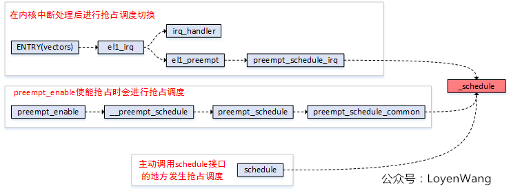 |

##### preepmt

|  |
| ------------------------------------------------------------ |

##### context_switch

| 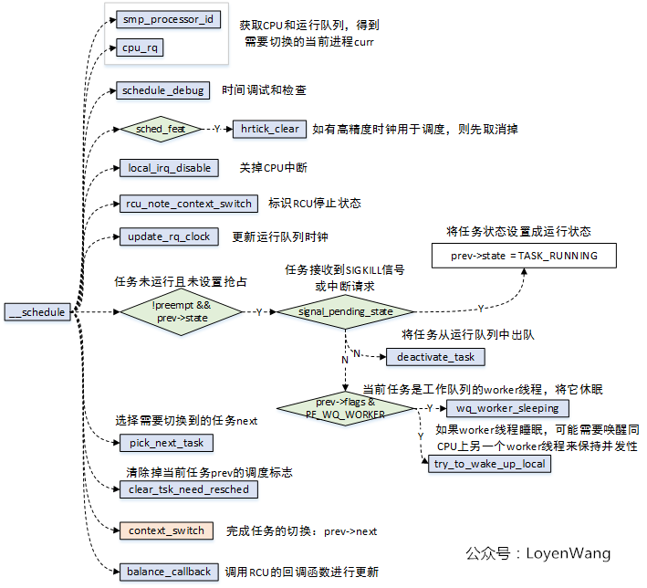 |
| ------------------------------------------------------------ |
| 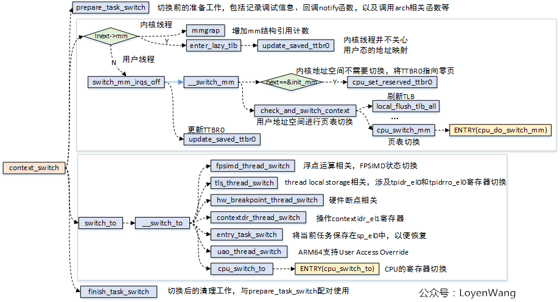 |

#### 负载及进程维护

##### 数据结构

| 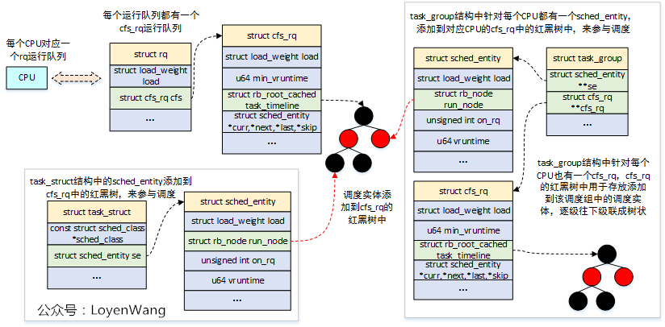 |
| ------------------------------------------------------------ |

##### CFS及负载相关的初始

`load_weight`：调度实体的权重。nice值为-20到19， 默认为0，每提升1，减少10%CPU时间，降低1，增加10%CPU时间。为了计算方便，**nice为0的权重为1024**，其他的由`sched_prio_to_weight[40]`查表获取。

`sched_prio_to_wmult[40]`: $inv\_weight = \frac{2^{32}}{weight}$ , 即权重被倒转。

$vruntime = \frac{delt\_exec \\ * \\ nice\_0\_weight}{weight}$​, delta_exec实际的运行时间，nice_0_weight表示权重为0的权重值，weight表示该进程权重。

+ 进程初始化

```c
sched_fork
    1. exec_start, sum_exec_runtime, pre_sum_exec_runtime, vruntime=0;
	2. p->prio = parent->prio;
	// 3. p->static_prio = NICE_TO_PRIO(0); 若是有reset标志
	3. init_entry_runnable_average() // 设置了sa->load_avg = se->load.weight; 而调度组也调用了该函数，但是只是不sa设置为了0；
    3. 设置se->cfs_rq= tg->cfs_rq[cpu];
	
	*. task_fork_fair

	4. se->vruntime = curr->vruntime;
	5. se->vruntime = max(cfs_rq->min_vruntime+ sched_vslice(cfs_rq, se), se->vruntime); // 最小虚拟时间 + 配置时间
	6. se->vruntime -= cfs_rq->min_vruntime; // 补偿的原因是什么？？因为enqueue_entity会加上 cfs_rq->min_vruntime;

// 初始化p时，没有涉及初始化的变量都是复制父进程的。
// 所以新进程的调度组与父进程是同一个。
```

| 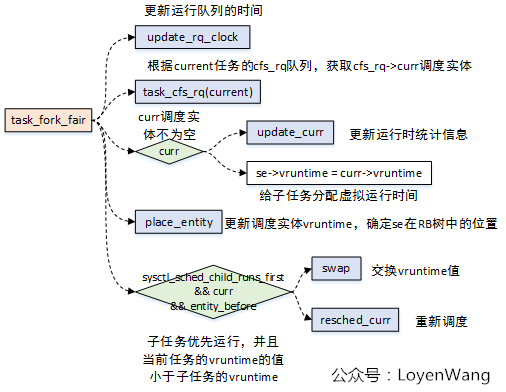 |
| ------------------------------------------------------------ |

##### 负载值的更新: 

+ ==update_load_avg==

| 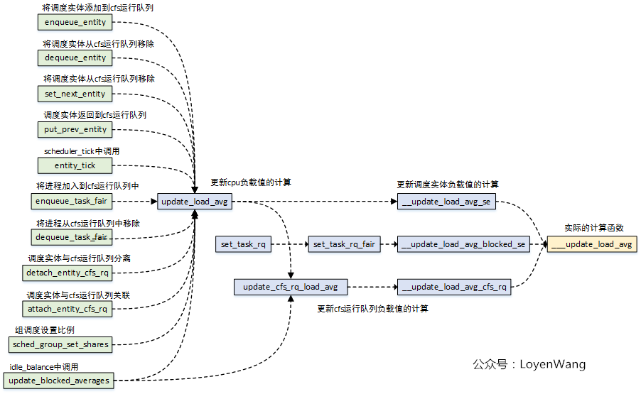 |
| ------------------------------------------------------------ |
| 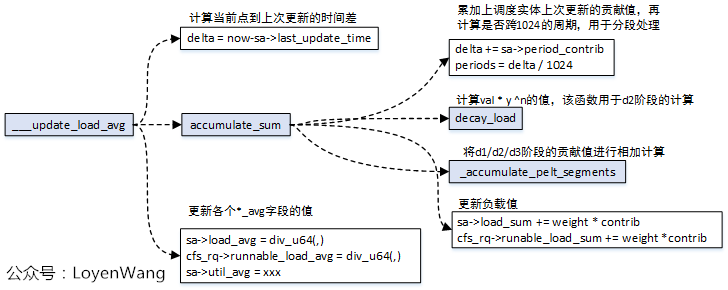 |

| 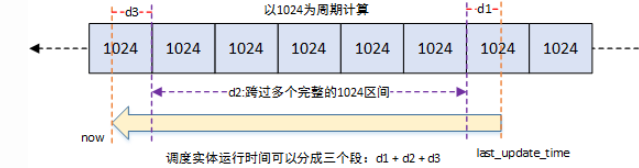 |
| ------------------------------------------------------------ |

```c 
update_load_avg(cfs_rq, se):
	1. 若不是首次更新 且 !(flag&SKIP_AGE_LOAD)， 则__update_load_avg_se
    
    2. update_cfs_rq_load_avg(now, cfs_rq);
	   propagate_entity_load_avg(se)
    
    3. 若是首次更新se->avg.last_update_time=0, 且 flag & DO_ATTACH, 则
           attach_entity_load_avg(cfs_rq, se);
		   update_tg_load_avg(cfs_rq);
	4. 若是发生负载衰减，则 
        cfs_rq_util_change;
		update_tg_load_avg(cfs_rq)
  
 __update_load_avg_se: // 更新se的load_sum与load_avg
	__update_load_sum
        1. delta = now - se->sa->last_update_time;
		2. sa->last_update_time += delta; 
		3. accumulate_sum:
            (1)sa->load_sum, runanle_sum, util_sum更新p个完整周期。
            (2)d1与d3两个段是否计算加上，取决于se->on_rq
        4. 若accumulate_sum发生更新，即p>0。则
    __update_load_avg:
		(1)计算sa->load_avg, sa->runnable_avg, sa->util_avg: 都是用对应的xxx_sum/(LOAD_AVG_MAX*y+sa->period_contib=d3)
    __cfs_se_util_change: 当前的sa->util_set.enquened &= UTIL_AVG_UNCHANGED
        
        
 update_cfs_rq_load_avg:
	(1)当cfs_rq->removed.nr>0, 则将sa->load_avg, util_avg, runable_avg都减去cfs_rq->removed.load_avg, sa->load_sum, util_sum, runable_sum复制为对应的xxx_sum * (LOAD_AVG_MAX*y+sa->period_contib=d3)
    (2) __update_load_avg_cfs_rq:
		1. __update_load_sum: // 同上，区别是更新的是cfs_rq->sa
		2. __update_load_avg;  // 同时，区别为cfs_rq->sa

attach_entity_load_avg(cfs_rq, se):
	(1)以当前的cfs_rq的sa的last_update_time, period_contrib跟新se的sa
    (2)以当前的se.avg.util_avg, runnable_avg * cfs_rq->(LOAD_AVG_MAX*y+sa->period_contib=d3)更新se的对应XXX_sum
    (3)enqueue_load_avg:
		cfs_rq->avg->load_avg, load_sum 加上se的
    (4) cfs_rq->avg->util_xx, runnable_xx加上se的

 update_tg_load_avg:
	更新cfs_rq->tg_load_avg_contrib // tg's load avg
		
```

| 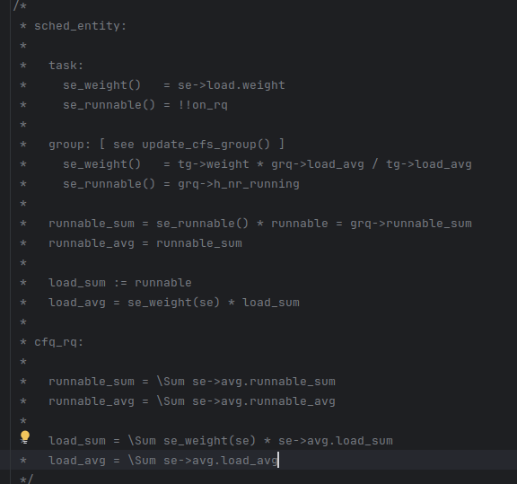 |
| ------------------------------------------------------------ |

+ 周期执行函数

| 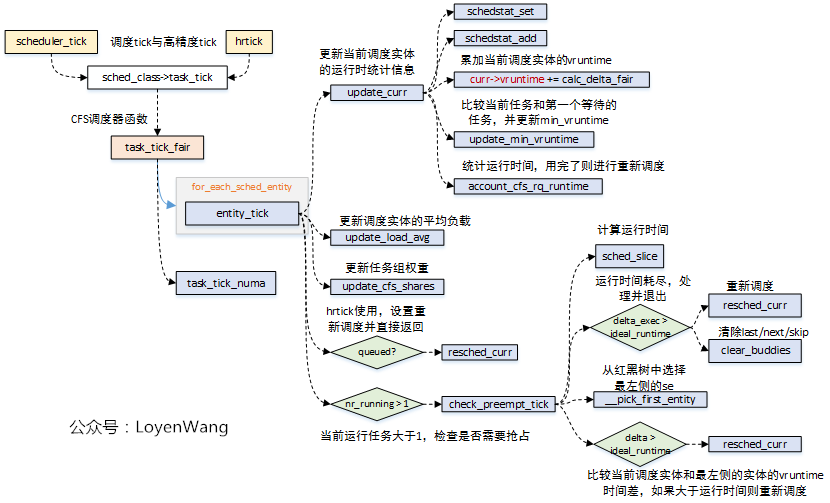 |
| ------------------------------------------------------------ |

+ ==update_curr==

```c
// 依据传入的cfs_rq，更新其cfs_rq->curr的sum_exec_runtime，vruntime两个值(都是原值基础上增加)。
1. now = rq_clock_task(rq);
2. delta = now - cfs_rq->curr->exec_start;
3. curr->exec_start = now;
4. curr->sum_exec_runtime += delta;
5. curr->vruntime += calc_delta_fair(delta, curr); // 相对于nice0的相对值
6. cfs_rq->min_vruntime = min(cfs_rq->min_vruntime, cfs_rq->left_node->vruntime);
7. 若cfs_rq->curr为进程： // 更新一些不太重要的（？）统计信息
    cgroup_account_cputime;
	account_group_exec_runtime;

8. account_cfs_rq_runtime; // 若是开启了带宽限制，且cfs_rq->runtime_remaining -= delta < 0, 且 !assign_cfs_rq_runtime, 则重新调度
```

+ 常用函数

###### `assign_cfs_rq_runtime`

```c
1. cfs_b = tg_cfs_bandwidth(cfs_rq->tg);
2. min_amount = target_runtime - cfs_rq->runtime_remaining; (target_runtime为一个定值)	
3. __assign_cfs_rq_runtime:
	1. 若是cfs_b->quota==INF, amount = min_mount
    2. 否则，(1) 唤醒cfs_b->period_timer;
			(2) 若cfs_b->runtime>0,则 amount = min(cfs_b->runtime, min_amount)
    3. cfs_b->runtime_remaining += amount;
```

###### `update_rq_clock`

```c
delta = sched_clock_cpu(cpu);
rq->clock += delta;
rq->clock_task += delta;  
```

###### `sched_vslice`

| 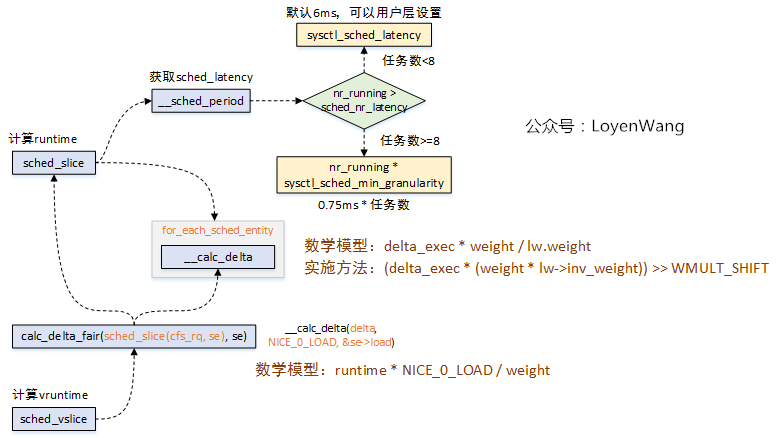 |
| ----------------------------------------------------------- |

###### `update_cfs_group`

```c
entity_tick -> update_cfs_group
// 当se->load.weight !+=  se->cfs_rq->tg->shares时
1. 计算新的shares;
2. 将实体拿出插入重新计算权重;
```


##### 全局CPU负载

+ `active task（活动任务）`：活动任务包括了`TASK_RUNNING`和`TASK_UNINTERRUPTIBLE`两类任务。包含`TASK_UNINTERRUPTIBLE`任务的原因是，这类任务经常是在等待I/O请求。
+ `NO_HZ`：Linux内核每隔固定时间发出`timer interrupt`，而`HZ`是用来定义1秒中的`timer interrupts`次数，`HZ`的倒数是`tick`，是系统的节拍器。周期性的时钟中断带来的问题是，不管CPU空闲或繁忙都会触发，会带来额外的系统损耗，因此引入了`NO_HZ`模式，

| 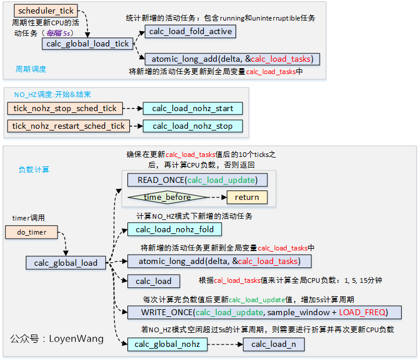 |
| ------------------------------------------------------------ |

Linux内核中定义了三个全局变量值`avenrun[3]`，用于存放最近1/5/15分钟的平均CPU负载。

calc_load:  $active=calc\_load\_tasks$

| 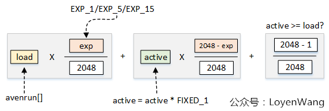 |
| ------------------------------------------------------------ |

假如某个cpu起始时load=0.5

| 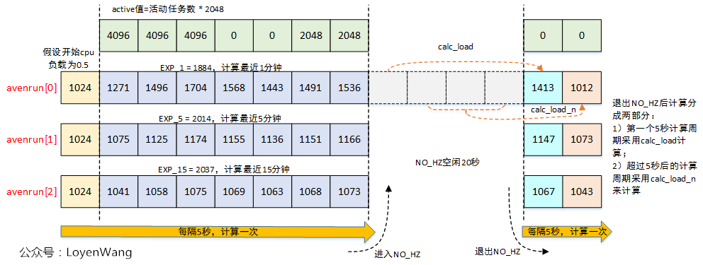 |
| ------------------------------------------------------------ |

##### 运行队列CPU负载

- Linux系统会计算每个tick的平均CPU负载，并将其存储在运行队列中`rq->cpu_load[5]`，用于负载均衡；

| 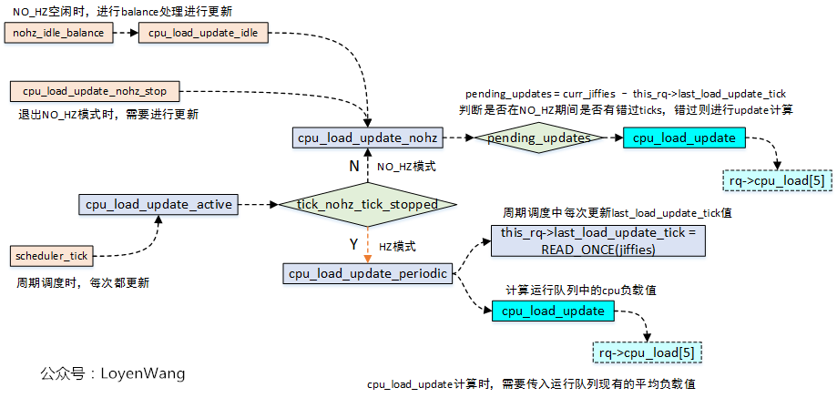 |
| ------------------------------------------------------------ |
| 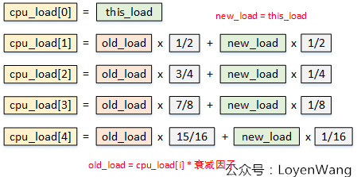 |

##### PELT


```c
struct sched_avg {
	u64				last_update_time;       //上一次负载更新的时间，主要用于计算时间差；
	u64				load_sum;                   //可运行时间带来的负载贡献总和，包括等待调度时间和正在运行时间；
	u32				util_sum;                     //正在运行时间带来的负载贡献总和；
	u32				period_contrib;           //上一次负载更新时，对1024求余的值；
	unsigned long			load_avg;           //可运行时间的平均负载贡献；
	unsigned long			util_avg;           //正在运行时间的平均负载贡献；
};
```

##### task_group

| 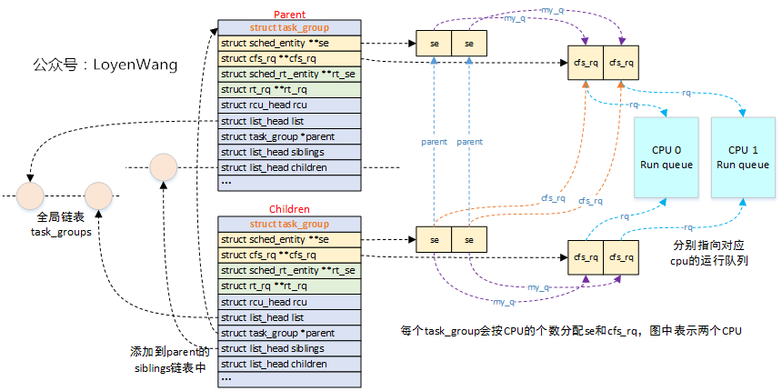 |
| ------------------------------------------------------------ |
| 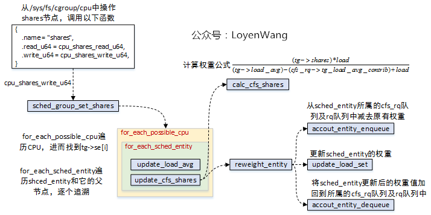 |
| 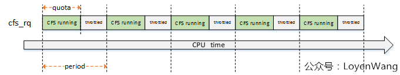 |
| 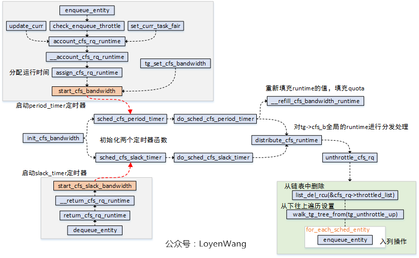 |
| 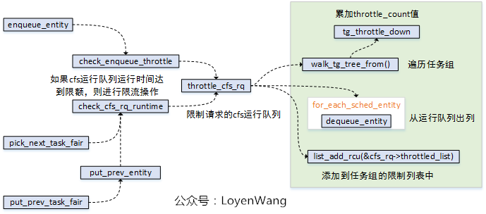 |

> [【原创】（四）Linux进程调度-组调度及带宽控制 - LoyenWang - 博客园](https://www.cnblogs.com/LoyenWang/p/12459000.html) 带宽控制详见

````c
sched_create_group:
	alloc_fair_sched_group
        tg->shares = NICE_0_LOAD
        init_cfs_bandwidth(tg_cfs_bandwidth(tg));

void init_cfs_bandwidth(struct cfs_bandwidth *cfs_b)
{
	cfs_b->runtime = 0;
	cfs_b->quota = RUNTIME_INF;
	cfs_b->period = ns_to_ktime(default_cfs_period());
    
    INIT_LIST_HEAD(&cfs_b->throttled_cfs_rq)

	hrtimer_init(&cfs_b->period_timer, CLOCK_MONOTONIC, HRTIMER_MODE_ABS_PINNED);
	cfs_b->period_timer.function = sched_cfs_period_timer;
	hrtimer_init(&cfs_b->slack_timer, CLOCK_MONOTONIC, HRTIMER_MODE_REL);
	cfs_b->slack_timer.function = sched_cfs_slack_timer;
	cfs_b->distribute_running = 0;
}

period_timer:
cfs_b->runtime += cfs_b->quota;
cfs_rq->runtime_remaining += runtime;
/* we check whether we're throttled above */
if (cfs_rq->runtime_remaining > 0)
    unthrottle_cfs_rq(cfs_rq);

slack_timer:
cfs_b->runtime += slack_runtime;
````

##### SMP负载均衡

```c
start_kernel->setup_arch->smp_init_cpus
	// 会查询ACPI或者DTS设置cpu_possible_mask

start_kernel->rest_init->kernel_init->kernel_init_freeable->smp_prepare_cpus
	err = cpu_ops[cpu]->cpu_prepare(cpu);
	if (err)
		continue;
	set_cpu_present(cpu, true);

start_kernel->rest_init->kernel_init->kernel_init_freeable->smp_init
	遍历cpu_present_mask：调用cpu_up,然后添加到cpu_active_mask中
```

```c
调度域构建过程：
start_kernel->rest_init->kernel_init->kernel_init_freeable->sched_init_smp->sched_init_domains


均衡函数：
rebalance_domains
	// 通过调用load_banlance达到目的
load_banlance:
```


##### 问题

起始阶段的0，1进程
