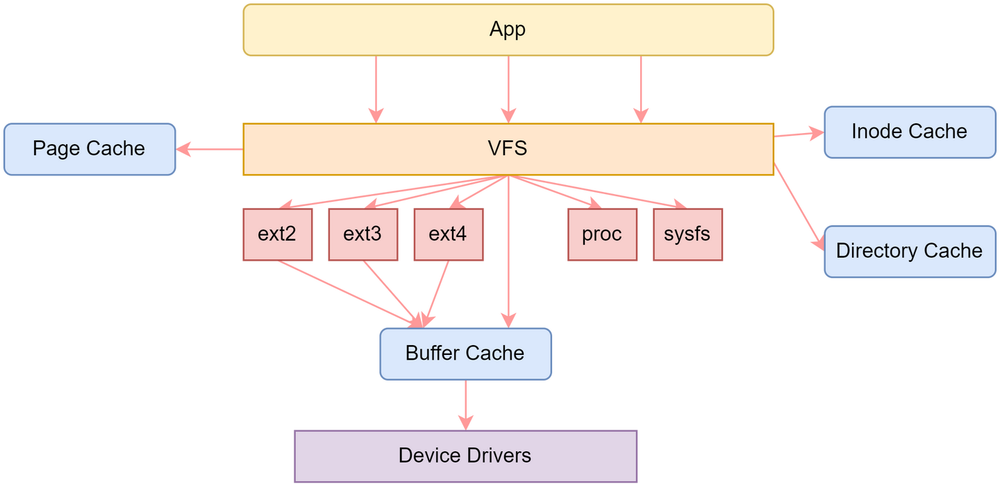
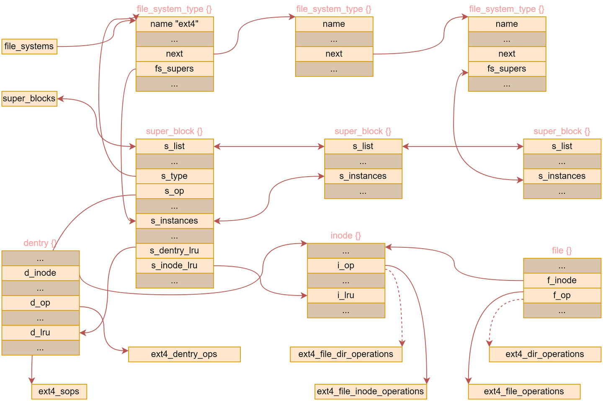
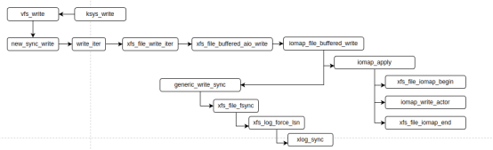

-------------------------------

### 指令 ⚙

#### 	:triangular_flag_on_post:硬盘

##### 		:one:创建与管理

- ​	**mdadm**

```shell
sudo mdadm --create /dev/md0 --level=10 --raid-devices=4 /dev/sda /dev/sdb /dev/sdc /dev/sdd
# 格式化，并挂载
mkfs.xfs -f /dev/md0
mount /dev/md0 mnt
```

> RAID将多个硬盘的能力结合起来，实现“协同工作”的
>
> — 硬件 RAID：
>   • 文件系统 → 块层 → RAID 控制器驱动 → RAID 控制器内部处理 → 物理设备
>   • 内核只认一个逻辑卷，RAID 算法在专用硬件上执行，对 CPU 负载影响较小。
>   • 硬件管理、缓存、热插拔及电池备份等功能通常内置在 RAID 控制器中。
>
> — 软件 RAID（mdadm）：
>   • 文件系统 → 块层 → md 设备（内核 md 驱动） → 分发到多个底层物理设备驱动
>   • RAID 机制在内核中实现，I/O 请求在 md 层经过分割、校验处理后再提交到底层磁盘。
>   • 灵活性高，易于监控、调整，但会增加内核处理开销，并依赖于 CPU 的运算能力。


##### 		:two:测试

+ **dd**

```shell
dd if=/dev/zero of=~/mnt/test oflag=sync bs=4K count=100000
```


------------------------------

### 工具 ⛏

#### 		:triangular_flag_on_post:iotop

>  用于监测实时磁盘I/O（输入/输出）性能
>
>  usage: `sudo iotop -o`
>
>  特点：查看进程为单位的io信息


#### :triangular_flag_on_post:iostat

> iostat 主要用于显示系统 CPU 使用率和块设备（磁盘等） I/O 性能信息
>
> usage：iostat
>
> 特点：可以查看磁盘为单位的具体的io信息


#### :triangular_flag_on_post:其他

> **free -h**: 当前系统内存的可用，已用，cache等大小，交换空间大小
>
> **df -h**: 磁盘的空间大小
>
> **sar**： 查看定期收集的系统信息(10分钟一次)。
>
> ​		sudo nano /etc/default/sysstat  -> ENABLED="true"
>
> ​		sudo systemctl restart sysstat
>
> ​		cat /proc/meminfo   详细的各内存信息
>
> ​	**mpstat**: sar的实时版本， `mpstat -P ALL`（查看所有CPU的信息,包含用户，内核，中断，I/O等各种部分的信息）
>
> 
>
> **perf top**: 以函数为单位查看性能开销
>
> **smem**: 查看具体的文件占据的大小
>
> ​		`sudo apt install smem`

#### :triangular_flag_on_post:日志

> dmesg
>
> journalctl 


### 文件系统 :file_folder:





```c
// 1.挂载
register_filesystem();  unregister_filesystem(); // 通过全局变量file_system连接
// 2.超级块
super_block ; //具体挂载的文件系统，包含挂载点等内容，除了放入文件系统的fs_supers外，还挂入到全局的super_blocks链表上
// 3.inode 从磁盘索引节点直接读入或者写回，对于文件与目录来说其i_op指向的内容不同

// 4.dentry文件或者目录名

// 5.fs_context: file_system_type 和 super_block 之间的桥梁，创建和配置 super_block 都离不开 fs_context

ext4_mount->mount_bdev:
	|-> blkdev_getby_path // 打开block设备
    |-> s_get   // 查询或者创建一个super_block (在链表上查询一个未使用的super_block)
        		// 没有则调用alloc_super分配	

// 注：i_op 对应文件系统的文件创建，搜索等内容，i_fop用于记录该文件系统的文件处理
    
        
        
do_mknodat -> do_mknodat -> vfs_create
|-> inode->i_op->create  // 此处inode为： struct inode *dir
        
ext4_create:
	|-> ext_new_inode_start_handle -> _ext4_new_inode // 分配一个inode
        |->  new_inode -> new_inode_pseudo -> alloc_inode
            if   |-> super->s_op->alloc_inode
            else |-> kmem_cache_alloc 
    
    |-> inode->i_op = &ext4_file_inode_operations    
    |-> inode->i_fop = &ext4_file_operations;


open:
	do_sys_open -> do_sys_openat2
    |-> get_unused_fd_flags  // 未使用的文件符
    |-> do_filp_open  // 打开文件，并将file插入到fdtab中
    	|-> path_openat // 进行目录查找
        	|-> do_open
        		|-> vfs_open
        			|-> do_dentry_open
        				|-> file->f_op = inode->i_fop // 初始化file->f_op,从inode								// 中获取(fops_get(inode->i_fop))
        				|-> file->f_op->open
        					|-> ext4_file_open
read:
	ksys_read -> vfs_read
    if   |-> file->f_op->read
    else |-> new_sync_read
         	|-> call_read_iter -> file->f_op->read_iter

write:
	ksys_write -> vfs_write
    if   |-> file->f_op->write
    else |-> new_sync_write
         	 |-> call_writer -> file->f_op_write_iter
      
cite: https://zhuanlan.zhihu.com/p/580959649
```


#### 	:triangular_flag_on_post:xfs

> **XFS** 是一个高性能、高度可扩展的日志文件系统，特别适合超大容量存储和高并发场景。而**ext4**偏向于兼容可靠性。

写分析：



### Will using

将的时候从大局出发怎么解决问题，或者比较特别的可以提及细节。


+ raid方法问题+源码（主要是看源码的逻辑， 民生银行xfs（不太好的样子））

+ qemu-kvm卡住（同样是源码）

+ 海光主要是watch dog相关带着一起（分析为啥为发生，不是由bug引发而是由资源竞争导致，民生银行服务器， 平安银行pod）

+ 杭州raid（驱动修复，此处源码，好像没有）

+ 未解决的问题：建行slab，建行服务器异常重启，交通银行裸金属（不太好），民生银行add watch（还不错）

+ 各种社区提供解决方案的例子-》kylin ext4优化

  >找死锁逻辑：1.先找应为什么锁；2.锁的状态，是否被释放了；3.找持锁者，看为什没有释放锁
  >
  >

#### need

+ 开启crash调试看看
+ 开启watchdog试试

### :crossed_swords: 案例分析

##### 文件系统:open_file_folder:

:white_large_square: raid写放大问题

> RAID介绍：
>
> ​	mdadm: 允许用户使用多个物理磁盘组合成一个逻辑磁盘，以实现数据冗余、性能提升或两者兼顾。
>
> ​	RAID 0（条带化，并行读写）:将数据均匀分割到不同磁盘，读取和写入速度显著提高，但无冗余。
>
> ​	RAID 1（镜像）：数据完全复制到多块硬盘，一块坏了另一块依然完整。
>
> ​	RAID 10（镜像+条带化）：结合 RAID 0 和 RAID 1。

问题：

```shell
mdadm -Cv /dev/md0 -a yes -n 4 -l 10 /dev/sda /dev/sdb /dev/sdc /dev/sdd
mkfs.xfs -f /dev/md0
mount /dev/md0 mnt

dd if=/dev/zero of=~/mnt/test oflag=sync bs=4K count=100000

# 调用iotop观察写如情况时，发现写放大（真实写磁盘数据量大于目标写入量）
```

原因：

1. 在xfs文件系统中，当带sync写时，在调用链的generic_write_sync中会检查sync标志。完成每次写操作的同步。

2. 但是除了写操作的同步，还存在日志的同步及`xlog_sync`函数，在该函数中最终调用`xlog_bdstrat`完成日志的io提交。
3. 而在日志写的过程中会以`chunk size`的大小对齐。（导致写回的日志需求量大于数据的写回量）

相关内容：

1. 条带大小指的是在每个磁盘上存储的数据块的大小。小条带适合小文件的读写，数据会被分散到更多磁盘，增加并行度（增加 I/O 请求次数，处理开销较大）。大条带适合大文件顺序读写，可以减少 I/O 请求次数，提高吞吐量。（小文件或随机 I/O 可能只使用部分条带，导致读写效率不均。）
2. 同时：如果条带大小过大，而应用程序经常读写远小于条带大小的数据，可能导致“内部碎片”，即磁盘读写了比实际数据更多的内容，浪费 I/O 资源。
3. 条带宽度：数据盘的数量 × 条带大小（影响并行度）
4. XFS 是一种高性能的、支持大文件和高并发的日志文件系统（Journaling File System）。它采用了**日志（Journal）机制**来保证文件系统的一致性和崩溃恢复能力。

- [ ] 等待过一遍源码 :eyes:


:white_large_square:qemu-kvm卡住（进程丢失）

```
现象：qemu-kvm读取文件卡住，复现概率大约1到3天就会出现。复现概率较高。block 120S。
__switch_to+0xe8/0x150
  __schedule+0x36c/0x840
schedule+0x30/0xe0
io_schedule+0x20/0x90
iomap_dio_rw+0x380/0x460
ext4_file_write_iter+0x4b0/0x700
do_iter_readv_writev+0x138/0x1c8
do_iter_write+0x9c/0x1a

for (;;) {
	__set_current_state(TASK_UNINTERRUPTIBLE);
	if (!READ_ONCE(dio->submit.waiter))
		break;

	if (!(iocb->ki_flags & IOCB_HIPRI) ||
		!dio->submit.last_queue ||
		!blk_poll(dio->submit.last_queue,
		dio->submit.cookie, true))
			io_schedule();
}
__set_current_state(TASK_RUNNING);

if (atomic_dec_and_test(&dio->ref)) {
	if (dio->wait_for_completion) {
		struct task_struct *waiter = dio->submit.waiter;
		WRITE_ONCE(dio->submit.waiter, NULL);
		wake_up_process(waiter);
}
```

```
			CPU1												CPU2
current->state = TASK_UNINTERRUPTIBLE;
if(no resource):												
															release resource;
																wake_up
	schedule();

1. 由于state的值在调用schedule时，不一定被写回，导致可能wake_up先于schedule执行，导致schedule执行后无进程唤醒睡去进程;
2. 所以设置状态时要使用set_current_state(TASK_UNINTERRUPTIBLE);暗含内存屏障。
```

调试分析：

+ 打印dio->submit.waiter相关的信息（待读源码）:eyes:

##### Soft/hard lockup  :lock:

:white_large_square: **soft lockup**

> 给每个CPU分配一个定时执行的内核线程[watchdog/x]，如果该线程在设定的期限内没有得到执行的话就意味着发生了soft lockup，[watchdog/x]是SCHED_FIFO实时进程，优先级为最高的99，拥有优先运行的特权。
>
> 实现：内核中的一个高精时钟定时产生中断，中断处理为:1. 唤醒`watchdog/x`（更新soft_lockup_hrtimer_cnt=hrtimer_interrupts）；2. 同时检查时间戳是否更新()，未则`watchdog/x`未被运行;3. 增加一个计时器值`hrtimer_interrupts`
>
> echo 1 > /proc/sys/kernel/softlockup_panic
>
> 人工产生：spinlock();


经验角度：

+ 负载高某些任务长时间占据CPU；任务死锁；内存资源不足，页面回收与页面交换，导致的长时间等待页面；大量的I/O操作导致任务不能及时执行；资源不足导致的不能及时调度；大量中断导致的不能及时调度。

:fish: 北部湾：多个进程发生`soft lockup`且堆栈内容不定，可能由I/O资源导致的。

:fish: 海光：:red_circle:

​	现象： 跑一个编译任务，都特别卡，服务器出现异常打印信息，且无法ssh连接操作。

 	1. 日志发现soft lockup，调用栈处于分配页面。查看系统资源发现仅仅存在几百M可用内存，存在20kbuffer/cache。
 	2. 且2个内存条来自不同厂商，不同大小。(更换同一品牌的内存后，仍然存在卡顿现象)
 	3. 查看`top`，发现存在大量running进程。`lscpu`发现大量的256个CPU核心都在NUMA0上。
 	4. 同时在系统日志上，发现了`No NUMA configuration found`。同时内核启动参数并没有禁用`NUMA`。
 	5. 当进入BIOS中后，重新启用NUMA后，各NUMA节点分配了16个物理CPU核心。
 	6. `mpstat`发现中断的占比高，同时发现，`/proc/interrupts` 中`LOC`中断比例较高
 	7. `LOC`高可能是因为CPU频率高导致的（也有可能内存不足，磁盘I/O过高导致）。
 	8. 考虑可能是CPU性能单核性能问题，`cat /sys/devices/system/cpu/cpu*/cpufreq/cpuinfo_cur_freq`查看各核心频率，发现部分CPU核心频率异常。
 	9. 为了较小CPU频率波动的影响，所以在BIOS中添加关闭CPU超频的功能，还禁用了CPU的c-state自适应功能，使CPU持续保持在C0状态—即其最佳性能状态，减少由于状态切换引起的性能损耗，来提高单核处理能力，同时禁用超超线程，提高整体的处理效率和稳定性。

原因：

1. 高负载且多线程的编译环境下，关闭NUMA可能会引发内存资源的竞争加剧。
2. CPU硬件设置导致的问题。

:white_large_square:**hardware lockup**: 

> CPU不仅无法执行其它进程，而且不再响应中断。检测hard lockup的原理利用了PMU的NMI perf event，因为NMI中断是不可屏蔽的，在CPU不再响应中断的情况下仍然可以得到执行，它再去检查时钟中断的计数器hrtimer_interrupts是否在保持递增，如果停滞就意味着时钟中断未得到响应，也就是发生了hard lockup。
>
> 当PMU的计数器溢出时会触发NMI中断，处理函数`watchdog_overflow_callback()`
>
> 人工产生：spin_lock_irqsave
>
> echo 1 > /proc/sys/kernel/nmi_watchdog

:+1:参考： https://blog.csdn.net/ericstarmars/article/details/81750919


:red_circle::fish:东方:

​	现象:

	1.  看门狗超时导致重启
	1.  CPU利用率不高，磁盘I/O没有明显的问题。

解决：

1. 查找处非系统预装包，发现了`bmc-watchdog`。在该服务的日志出现error。==服务的日志如何查看==。

2. 查看日志发现向bmc发送reset timer的指令时，bmc返回0xff错误，且出现ipmi驱动报错。发送get timer同样返回0xff错误。历经15min后发生重启。此时长与bmc-watchdog的超时时间相同。 `systemctl statusbmc-watchdog`
3. ipmi驱动的执行: `ipmi_thread`->`smi_event_handler`

原因：

1. 可能由于bmc异常导致了问题，具体未知。
2. 升级bmc或者是否其他未知应用向bmc发送命令，导致bmc与ipmi的交换逻辑错误。  

##### :car: 驱动

:fish: 杭州RAID

现象：某银行使用4.19.xxx的内核，同时使用了华为raid卡SP686，该内核没有进行对应的 raid driver(hisi_raid)合入，所以之前使用kmod形式进行外部安装。先内核升级为23.42后，无法使用kmod包安装hisi_raid驱动。

> sudo rpm -ivh kmod-hisi_raid*.rpm //显示KABI不兼容
>
> modprobe hisi_raid（自动处理依赖关系）或者insmod hisi_raid.ko

1. 手动编译时出现，`blk_mq_tagset_busy_iter`函数指针类型错误
2. 然后依据报错信息重新编译了驱动。


:white_large_square:深信服

+ 压力脚本未知

现象：

+ 出现KASAN的bug，显示为`use-after-free in blk_mq_tag_wakeup_all`

问题：变量释放后再次调用导致问题。

原因：代码设计为未分考虑到资源不足，导致的错误路径。进而导致变量被释放后，仍然错误路径访问。

:white_large_square:华为云

