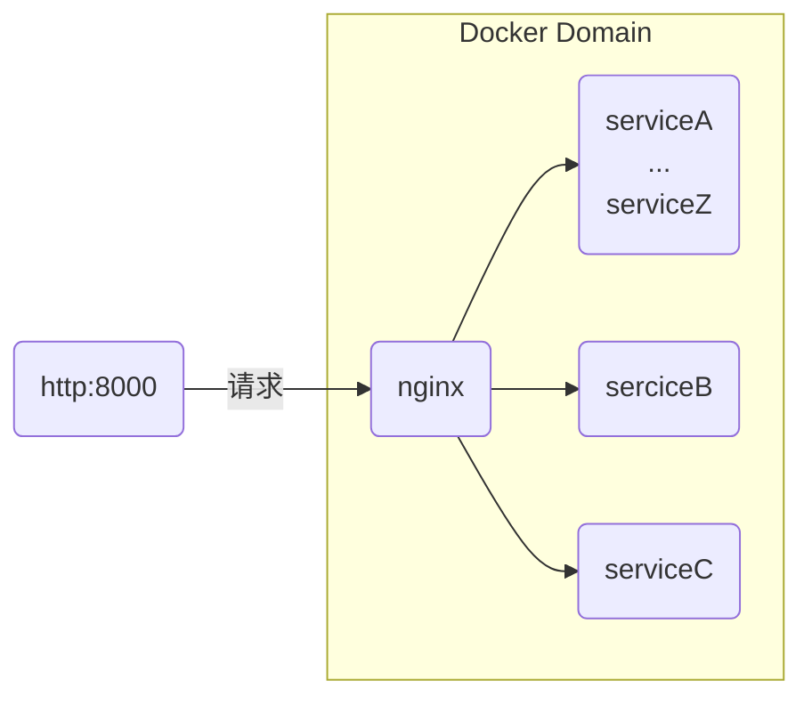
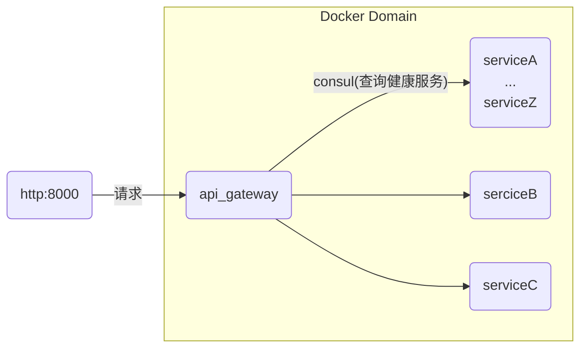
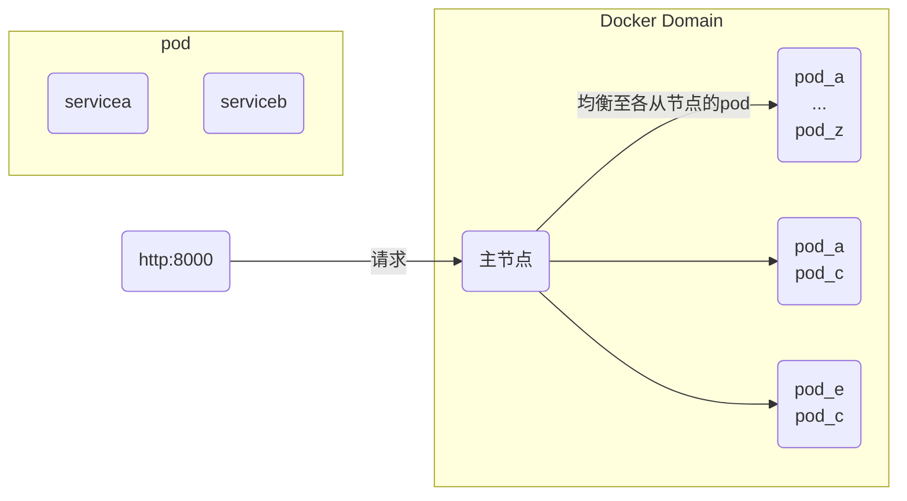

##### Nginx

> 用于反向代理, 负债均衡

相比较与自己设计的反向代理，特殊设计:

+ 采用时间驱动，而不是阻塞I/O，采用**epoll**的高效事件通知机制
+ 每个worker同时处理多个连接，master负责配置，监控
+ 高效的内存池管理，零拷贝数据：直接由磁盘传输到网络接口

##### 简要部署方案

:one:  借助nginx代理

:two:使用consul

> **nginx**内置负载均衡适合静态的拓扑配置。而Consul，复杂均衡由API网关实现，允许动态注册配置。

:three:kubenets

:four: Knative

> Knative 是构建在 Kubernetes 之上的一套扩展和工具集。提供了更高级的抽象和自动扩缩容机制。
>
>  Knative Serving ：能够根据实际的流量自动扩展服务实例。当请求量剧增时，Knative 会在 Kubernetes 集群中动态创建更多 Pod 来应对流量；当流量低谷时，又能自动缩减资源（甚至缩容到0）。对于周期性、间歇性的流量，Knative 可以将没有请求的服务自动缩容到零。

